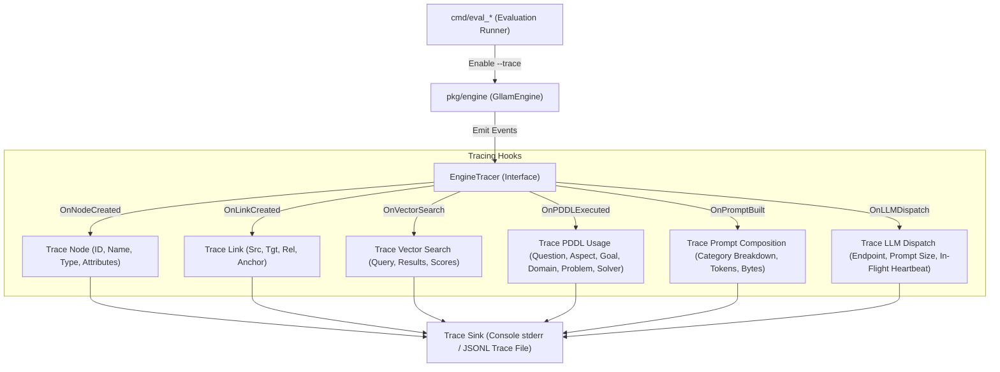

# PLAN: Benchmark Execution Tracing & Telemetry System

> [!IMPORTANT]
> **Implementation Status**: 🟡 **PARTIALLY IMPLEMENTED**
> - ✅ **Implemented**: PDDL invocation trace logging (`router.go`), Context breakdown & token size indicators (`eval_d7_qa`).
> - 📋 **Planned**: Live in-flight token streaming heartbeats in CLI runner.

## 1. Executive Summary & Objective

Currently, running benchmark evaluations (such as `eval_d7_qa` or `eval_beam`) provides limited visibility into the inner workings of the `GllamEngine`. Standard output currently displays only the question being processed and the raw count of nodes returned by `SearchSimilarNodes`. During large prompt assembly and LLM inference, the runner appears "stuck" for long durations without feedback on prompt size or generation progress.

This plan outlines a telemetry and tracing system designed to provide deep observability into:
1. **Node & Link Creation**: Real-time tracing of every `SemanticNode` and `SemanticLink` generated or inserted into memory during ingestion/recall.
2. **PDDL Engine & Reasoning Pipeline**: Observability into PDDL usage whenever PDDL is invoked, capturing full details of the **user question**, selected **sub-domain aspect** (`AspectAll`, `AspectTemporal`, `AspectInstruction`, `AspectStateTransition`), generated **domain definition**, generated **problem/goal definition**, and solver execution steps.
3. **Graph Operations & Context Retrieval**: Detailed logging of `SearchSimilarNodes`, vector distance scores, graph traversals, and working memory context assembly.
4. **Prompt Breakdown & LLM In-Flight Visibility**: Granular breakdown of context sources (semantic nodes, graph links, episodic memory, PDDL rules, system instructions) contributing to prompt construction, total character/token volume, and live heartbeats/progress indicators during long LLM inference runs.

---

## 2. Architecture & Design



### 2.1 Trace Event Definitions

We will introduce a lightweight `Tracer` interface and structured event model in `pkg/engine/tracer.go`:

```go
type TraceEventType string

const (
    TraceEventNodeCreated   TraceEventType = "NODE_CREATED"
    TraceEventLinkCreated   TraceEventType = "LINK_CREATED"
    TraceEventVectorSearch  TraceEventType = "VECTOR_SEARCH"
    TraceEventPDDLInvoked   TraceEventType = "PDDL_INVOKED"
    TraceEventPDDLCompiled  TraceEventType = "PDDL_COMPILED"
    TraceEventPDDLSolved    TraceEventType = "PDDL_SOLVED"
    TraceEventPromptBuilt   TraceEventType = "PROMPT_BUILT"
    TraceEventLLMStart      TraceEventType = "LLM_START"
    TraceEventLLMHeartbeat  TraceEventType = "LLM_HEARTBEAT"
    TraceEventLLMComplete   TraceEventType = "LLM_COMPLETE"
)

type PDDLUsageTrace struct {
    Question       string   `json:"question"`
    Aspect         string   `json:"aspect"`
    GoalExpression string   `json:"goal_expression"`
    DomainName     string   `json:"domain_name"`
    DomainContent  string   `json:"domain_content"`
    ProblemContent string   `json:"problem_content"`
    NodeCount      int      `json:"node_count"`
    LinkCount      int      `json:"link_count"`
    PlanFound      bool     `json:"plan_found"`
    PlanActions    []string `json:"plan_actions,omitempty"`
}

type PromptContextStats struct {
    SemanticNodeCount  int `json:"semantic_node_count"`
    SemanticNodeChars  int `json:"semantic_node_chars"`
    SemanticLinkCount  int `json:"semantic_link_count"`
    SemanticLinkChars  int `json:"semantic_link_chars"`
    EpisodicChunkCount int `json:"episodic_chunk_count"`
    EpisodicChunkChars int `json:"episodic_chunk_chars"`
    PDDLRulesCount     int `json:"pddl_rules_count"`
    PDDLRulesChars     int `json:"pddl_rules_chars"`
    SystemPromptChars  int `json:"system_prompt_chars"`
    TotalPromptChars   int `json:"total_prompt_chars"`
    EstTokenCount      int `json:"est_token_count"`
}

type TraceEvent struct {
    Timestamp  time.Time              `json:"timestamp"`
    InstanceID string                 `json:"instance_id,omitempty"`
    EventType  TraceEventType         `json:"event_type"`
    Message    string                 `json:"message"`
    Data       map[string]interface{} `json:"data,omitempty"`
}

type EngineTracer interface {
    Trace(event TraceEvent)
}
```

---

## 3. Scope of Instrumentation

### 3.1 Graph Operations Instrumentation (`pkg/engine/semantic.go`)
- **`InsertNode` / `StoreNodeEmbedding`**: Emit `TraceEventNodeCreated` with node ID, node type, name, context prompt, and attributes.
- **`AddLink`**: Emit `TraceEventLinkCreated` with source ID, target ID, relationship name, temporal anchor ID, and weight.
- **`SearchSimilarNodes`**: Emit `TraceEventVectorSearch` with query string, limit requested, candidate node IDs, names, and similarity distance scores.

### 3.2 PDDL Reasoning Pipeline (`pkg/engine/pddl_compiler.go` & `pkg/engine/planner.go`)
Whenever PDDL compiling or solving is triggered, emit `TraceEventPDDLInvoked` & `TraceEventPDDLCompiled` with full `PDDLUsageTrace` details:
- **`Question`**: The user prompt / evaluation query that triggered PDDL extraction.
- **`ExtractPDDLGoalAndAspect`**: Emit aspect selected (`AspectTemporal`, `AspectInstruction`, `AspectStateTransition`, `AspectAll`) and derived goal predicate expression.
- **`CompileGraphToPDDLAspect`**: Emit full PDDL `domain_content` string and PDDL `problem_content` string along with filtered node/link counts.
- **`SolvePDDL`**: Emit `TraceEventPDDLSolved` capturing planner invocation status, step-by-step action sequence, or validation error.

In console `--verbose` mode, print a formatted snippet:
```text
[PDDL Usage] Question: "Did Seun help with the gardening before or after Tasha started taking care of it?"
  ├── Aspect: AspectTemporal
  ├── Goal: (and (before (event seun_gardening) (event tasha_gardening)))
  ├── Domain: (define (domain gllam_temporal_domain) ...) [34 lines]
  ├── Problem: (define (problem gllam_temporal_prob) ...) [28 lines]
  └── Solver Result: Plan found (3 actions: [ingest_event, order_temporal, verify_goal])
```

### 3.3 Prompt Construction & LLM In-Flight Progress (`pkg/engine/llm.go` & `pkg/engine/router.go`)
- **Prompt Composition Telemetry (`PromptContextStats`)**:
  - Print explicit category breakdown before submitting to the model:
    ```text
    [Prompt Built] Total Size: 14,250 chars (~3,560 tokens)
      ├── Semantic Nodes:  18 items (4,200 chars)
      ├── Semantic Links:  24 items (2,100 chars)
      ├── Episodic Memory:  6 chunks (6,500 chars)
      ├── PDDL / Rules:     2 rules  (850 chars)
      └── System Prompt:   (600 chars)
    ```
- **In-Flight LLM Heartbeat / Progress**:
  - Emit `TraceEventLLMStart` when dispatching HTTP request to LLM server (`http://100.96.179.19:8888`).
  - Spawn background ticker emitting periodic heartbeat updates every 5 seconds (e.g. `[LLM In-Flight] Waiting for response... elapsed 15s (Prompt: ~3.5k tokens)`).
  - Emit `TraceEventLLMComplete` with execution latency (ms) and generated response length.

### 3.4 Evaluation Runners (`cmd/eval_d7_qa`, `cmd/eval_beam`, `cmd/gllam`)
- Add CLI flags:
  - `--verbose` / `-v`: Print colorized, human-readable trace logs and prompt stats to `stderr` during benchmark execution.
  - `--trace-file <path>`: Write structured JSONL events to a dedicated trace log (e.g. `./bench/d7_qa_trace.jsonl`).

---

## 4. Implementation Steps (Post-Benchmark Execution)

Once the current benchmark run finishes, implementation will proceed as follows:

1. **Step 1: Core Telemetry Framework & Event Definitions**
   - Create `pkg/engine/tracer.go` defining `EngineTracer`, `ConsoleTracer`, `JSONLTracer`, `PromptContextStats`, and `PDDLUsageTrace`.
   - Add optional `Tracer` field to `GllamEngine`.

2. **Step 2: Engine & Graph Instrumentation**
   - Hook tracer into node insertion and link creation methods in `pkg/engine/semantic.go`.
   - Hook tracer into `SearchSimilarNodes` vector search results in `pkg/engine/semantic.go`.

3. **Step 3: PDDL Pipeline Instrumentation**
   - Instrument goal extraction, aspect selection, and PDDL generation in `pkg/engine/pddl_compiler.go`.
   - Log question text, compiled domain, compiled problem, and solver plan steps in `pkg/engine/planner.go`.

4. **Step 4: Prompt Breakdown & LLM Progress Instrumentation**
   - Add context breakdown accounting in `pkg/engine/router.go` and `pkg/engine/llm.go`.
   - Implement asynchronous heartbeat ticker during LLM HTTP calls so evaluation output never freezes.

5. **Step 5: CLI & Evaluation Runner Integration**
   - Update `cmd/eval_d7_qa/main.go` and `cmd/eval_beam/main.go` to accept `--verbose` and `--trace-file`.
   - Ensure stdout remains clean for result JSONL pipes while detailed execution traces and progress metrics flow to stderr or `--trace-file`.

---

## 5. Verification & Acceptance Criteria

- [ ] Running `eval_d7_qa` or `eval_beam` with `--verbose` displays live, readable logs for node creation, link creation, vector distances, and PDDL compilation.
- [ ] Every PDDL invocation logs the question, aspect, goal expression, full domain definition, problem definition, and solver output.
- [ ] Prompt assembly outputs a detailed statistical breakdown of memory sources (semantic, episodic, PDDL rules, system prompt) and total estimated token count.
- [ ] During long LLM calls, a periodic heartbeat (`elapsed Xs`) prevents the terminal output from appearing stuck.
- [ ] Running with `--trace-file ./bench/eval_trace.jsonl` produces a valid JSONL event log capturing full reasoning lineage, PDDL definitions, and prompt metadata.
- [ ] Zero performance degradation on production engine when tracer is `nil` (disabled).
