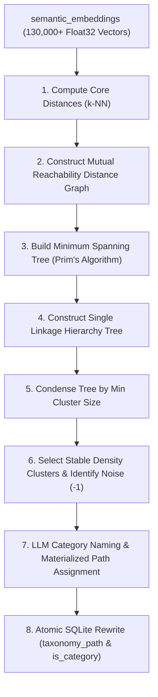

# PLAN: Pure-Go HDBSCAN Hierarchical Taxonomy Builder for GLLAM

> [!IMPORTANT]
> **Status**: 🟢 **PROPOSED ARCHITECTURE PLAN**
> - Integrates density-based hierarchical clustering (HDBSCAN) directly into GLLAM's Go engine.
> - Automatically constructs `taxonomy_path` hierarchies (`/Category/SubCategory/Node`) from high-dimensional `semantic_embeddings`.

---

## 1. Executive Summary & Existing Markdown Documentation Review

### Review of Existing GLLAM Taxonomy Plans:
1. **Materialized Paths & Category Schema** ([`autonomous_ontological_layer_plan.md`](file:///home/laurent/Projects/gllam/design/autonomous_ontological_layer_plan.md)):
   - Defines `taxonomy_path` (`/Engineering/Infrastructure/Databases/Postgres`) and `is_category` columns in `semantic_nodes`.
   - Uses Kahn's Topological Sort (`WouldCreateTaxonomyCycle`) to prevent taxonomy loops.
2. **Self-Healing Consolidation** ([`self_healing_taxonomy_plan.md`](file:///home/laurent/Projects/gllam/design/self_healing_taxonomy_plan.md)):
   - Focuses on discovering duplicate branches using vector centroids and string Jaccard distance during sleep cycles (`EnterMemorySleepCycle`).
3. **Homonym & Homograph Binding** ([`PLAN_homonym_disambiguation_taxonomy.md`](file:///home/laurent/Projects/gllam/design/PLAN_homonym_disambiguation_taxonomy.md)):
   - Binds ambiguous surface terms ("Crystal" person vs "crystal" gem) to distinct `taxonomy_path` branches.

### The Missing Link: Unsupervised Hierarchical Discovery
Existing plans rely on pair-wise similarity thresholds ($\text{Sim} \ge 0.88$) or flat classification. As GLLAM scales to **130,000+ nodes**, flat thresholding creates fragmented or over-broad categories.

**HDBSCAN (Hierarchical Density-Based Spatial Clustering of Applications with Noise)** provides a mathematically rigorous, unsupervised solution in Go:
- **No fixed $K$**: Automatically discovers the natural number of categories.
- **Native Hierarchy Tree**: HDBSCAN's internal condensed tree maps 1-to-1 to GLLAM's materialized path hierarchy (`/Parent/Child/Grandchild`).
- **Noise Awareness (`cluster_id = -1`)**: Isolated or unclassifiable nodes remain root entities (`taxonomy_path = '/'`) instead of being forced into arbitrary categories.

---

## 2. HDBSCAN Pure-Go Algorithmic Architecture



---

## 3. Step-by-Step Mathematical & Go Implementation

### Step 1: Core Distance Calculation ($core_k$)
For each node embedding vector $x_i$, compute $core_k(x_i)$, defined as the distance to its $k$-th nearest neighbor (using cosine distance $1 - \text{CosineSim}(x_i, x_j)$):

$$core_k(x_i) = d(x_i, N_k(x_i))$$

### Step 2: Mutual Reachability Distance
Compute the mutual reachability distance $d_{\text{mreach}-k}$ between every pair of nodes $x_i$ and $x_j$:

$$d_{\text{mreach}-k}(x_i, x_j) = \max \Big( core_k(x_i),\, core_k(x_j),\, d(x_i, x_j) \Big)$$

*Effect*: Pushes low-density (noise) points further away from all other points while keeping dense core regions close together.

### Step 3: Minimum Spanning Tree (Prim's Algorithm in Go)
Construct the Minimum Spanning Tree (MST) of the mutual reachability graph using **Prim's Algorithm** with a min-heap priority queue ($O(V^2)$ or $O(E \log V)$).

```go
type MSTEdge struct {
    Src   int
    Dst   int
    Weight float64
}

// BuildMST computes the Prim's MST over mutual reachability distances
func BuildMST(vectors [][]float32, coreDists []float64) []MSTEdge
```

### Step 4: Single Linkage Hierarchy Construction
Sort MST edges by weight in ascending order and build a hierarchy tree (dendrogram) using a **Disjoint Set Union (DSU)** data structure. Each merge operation creates a parent cluster node in the hierarchy.

### Step 5: Condensed Tree Extraction & Cluster Stability
Traverse the hierarchy tree from top to bottom:
- At each split, if a child cluster has size $< \text{minClusterSize}$ (e.g., $< 5$ nodes), mark those nodes as "falling out of the cluster" at density $\lambda = \frac{1}{\text{distance}}$.
- Compute **Cluster Stability** $S(C)$ by integrating the excess of mass over density range:
  $$S(C) = \sum_{x \in C} (\lambda_{\text{p_exit}} - \lambda_{\text{entry}})$$
- Select the most stable, non-overlapping clusters.

### Step 6: Materialized Path & Category Naming Pipeline
For each discovered cluster in the HDBSCAN tree:
1. Identify the hierarchy lineage (Parent Cluster $\rightarrow$ Child Cluster).
2. Collect the top 5 representative node names in the cluster.
3. Query a fast LLM (or use TF-IDF keyword extraction) to generate a concise 1-2 word Category Name (e.g., `"Drone Logistics"`, `"Coral Research"`).
4. Build the materialized path string: `/MarineBiology/CoralResearch/DroneLogistics`.
5. Atomic SQLite update in `semantic_nodes`:
   - Upsert category node (`is_category = 1`, `type = "category"`).
   - Set `taxonomy_path` for all member nodes.

---

## 4. Proposed Go Data Structures & API Signatures

```go
package engine

// HDBSCANConfig controls pure-Go density clustering parameters
type HDBSCANConfig struct {
	MinClusterSize int     // Minimum nodes per cluster (e.g. 5)
	MinSamples     int     // Neighbor count k for core distance (default: MinClusterSize)
	DistanceMetric string  // "cosine" or "euclidean"
}

// ClusterNode represents a node in HDBSCAN's condensed hierarchy tree
type ClusterNode struct {
	ClusterID   int
	ParentID    int
	MemberIDs   []string
	Children    []*ClusterNode
	CategoryName string
	TaxonomyPath string
	Stability   float64
}

// BuildHDBSCANOntology executes pure-Go HDBSCAN clustering on semantic_embeddings,
// names category clusters via LLM, and updates materialized taxonomy_path fields in SQLite.
func (e *GllamEngine) BuildHDBSCANOntology(ctx context.Context, config HDBSCANConfig) (*ClusterNode, error)
```

---

## 5. Benefits for GLLAM Architecture

| Feature | Flat Thresholding ($\text{Sim} \ge 0.88$) | Pure-Go HDBSCAN Hierarchy |
| :--- | :--- | :--- |
| **Hierarchical Depth** | Flat 1-level categories | Multi-level tree (`/A/B/C`) matching dendrogram |
| **Noise Resilience** | Forces every node into a category | Identifies noise (`cluster_id = -1`), leaving isolated nodes at `/` |
| **Cluster Shape** | Spherical (assumes uniform density) | Arbitrary density shapes (captures complex topic domains) |
| **Scaling & Memory** | Requires manually defined maps | 100% autonomous, zero external Python/C dependencies |

---

## 6. Verification Plan

1. **Unit Tests (`pkg/engine/hdbscan_test.go`)**:
   - `TestHDBSCANCoreDistance`: Verifies $k$-NN distance accuracy against synthetic 2D/high-dim points.
   - `TestPrimMST`: Verifies Prim's algorithm tree weight minimization.
   - `TestCondensedTreeStability`: Verifies cluster extraction and noise identification.
2. **Integration Test (`pkg/engine/taxonomy_hdbscan_test.go`)**:
   - Run `BuildHDBSCANOntology` over a test dataset of 200 nodes.
   - Assert `taxonomy_path` trees are updated correctly in SQLite and `WouldCreateTaxonomyCycle` passes with zero cycles.
