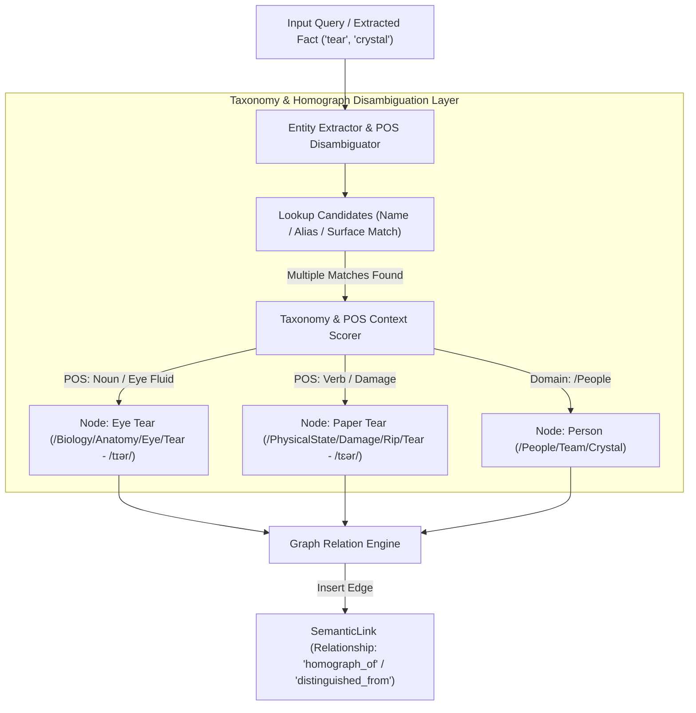

# PLAN: Homonym & Homograph Disambiguation via Ontological Taxonomy Binding

> [!IMPORTANT]
> **Implementation Status**: 🟡 **PARTIALLY IMPLEMENTED**
> - ✅ **Implemented**: `taxonomy_path` & `is_category` schema columns & migrations (`schema.sql`, `engine.go`), Taxonomy tree query functions (`taxonomy.go`).
> - 📋 **Planned**: POS tag & IPA phonetics matching for homographs in extractor.

## 1. Executive Summary & Problem Statement

In semantic memory graphs, **homonymity** (identical spelling and sound with different meanings, e.g., "Crystal" the person vs. "crystal" the gem), **homography** (identical spelling with different pronunciations and distinct meanings, e.g., "tear" in the eye [tɪər] vs. "tear" in a piece of paper [tɛər]), and **polysemy** create severe context corruption and vector space drift.

When querying memory, vector similarity or surface-keyword searches for "tear" or "crystal" can mistakenly merge or cross-retrieve:
- **Homonymy**: `SemanticNode{Name: "Crystal", Type: "agent", TaxonomyPath: "/People/Team/Crystal"}` vs `SemanticNode{Name: "crystal", Type: "concept", TaxonomyPath: "/Materials/Minerals/Gems/Crystal"}`
- **Homography**: `SemanticNode{Name: "tear", Type: "concept", TaxonomyPath: "/Biology/Anatomy/Eye/Tear", Phonetic: "/tɪər/"}` vs `SemanticNode{Name: "tear", Type: "action", TaxonomyPath: "/PhysicalState/Damage/Rip/Tear", Phonetic: "/tɛər/"}`

This plan defines a **Taxonomy-Bound Homonym & Homograph Disambiguation Engine** that leverages materialized taxonomy paths (`taxonomy_path`), phonetic/POS attributes, ontological `is_a` links, contextual scope scoring, and explicit `homograph_of` / `homonym_of` / `distinguished_from` graph relations to resolve ambiguous surface terms during ingestion and retrieval.

---

## 2. Architecture & Design



---

## 3. Core Disambiguation Strategies

### 3.1 Taxonomy Path & Part-of-Speech Lineage Scoping
Every node in `gllam` stores a materialized `taxonomy_path` and optional Part-of-Speech / IPA phonetic annotations:
- **Homonym (Person)**: `taxonomy_path = "/People/Team/Crystal"` (`is_category = 0`, `type = "agent"`)
- **Homonym (Material)**: `taxonomy_path = "/Materials/Minerals/Gems/Crystal"` (`is_category = 0`, `type = "concept"`)
- **Homograph (Eye Tear)**: `taxonomy_path = "/Biology/Anatomy/Eye/Tear"`, `phonetic = "/tɪər/"`, `pos = "noun"`
- **Homograph (Paper Tear)**: `taxonomy_path = "/PhysicalState/Damage/Rip/Tear"`, `phonetic = "/tɛər/"`, `pos = "noun/verb"`

When querying `SearchSimilarNodes`, vector similarity scores are multiplied by a **Taxonomy & Syntactic Context Alignment Coefficient**:

$$\text{FinalScore}(N) = \text{CosineSim}(Q, N) \times \left(1.0 + \mu \cdot \text{TaxonomyOverlap}(Q_{\text{context}}, N.\text{taxonomy\_path}) + \nu \cdot \text{POSFit}(Q_{\text{syntax}}, N.\text{pos})\right)$$

### 3.2 Explicit `homograph_of` / `distinguished_from` Link Relations
When the ingestion pipeline encounters a new node $N_{\text{new}}$ whose surface string matches an existing node $N_{\text{exist}}$ but whose `taxonomy_path` or `phonetic` signature belongs to a different domain:
1. Do **not** merge the nodes.
2. Create two distinct nodes ($N_{\text{new}}$ and $N_{\text{exist}}$).
3. Insert a bi-directional `SemanticLink` between them:
   - `Relationship`: `homograph_of` (or `homonym_of` / `distinguished_from`)
   - `CaveatText`: `"Disambiguation: Eye fluid (/tɪər/) vs. Physical rip in paper (/tɛər/)"`
   - `Weight`: `1.0`

### 3.3 Contextual Resolution Algorithm (`DisambiguateEntity`)

```go
type DisambiguationCandidate struct {
    Node             memory.SemanticNode
    VectorScore      float64
    TaxonomyMatch    float64
    POSMatch         float64
    TotalConfidence  float64
}

func (e *GllamEngine) DisambiguateEntity(ctx context.Context, surfaceName string, contextPrompt string) (*memory.SemanticNode, error) {
    // 1. Fetch candidate nodes matching surfaceName, aliases, or homographs
    candidates, err := e.GetNodesByNameOrAlias(ctx, surfaceName)
    if len(candidates) == 0 {
        return nil, nil // No existing entity
    }
    if len(candidates) == 1 {
        return &candidates[0], nil // Unique match
    }

    // 2. Multi-candidate homonym/homograph detected: compute taxonomy, POS & vector context fit
    bestMatch := RankHomonymAndHomographCandidates(candidates, contextPrompt)
    return bestMatch, nil
}
```

---

## 4. Database & Schema Additions

Support surface aliases, POS tags, and phonetic metadata for homograph resolution:

```sql
-- Schema addition for surface aliases & homograph attributes
CREATE TABLE IF NOT EXISTS entity_aliases (
    id TEXT PRIMARY KEY,
    node_id TEXT NOT NULL,
    alias TEXT NOT NULL,
    phonetic_ipa TEXT,
    part_of_speech TEXT,
    taxonomy_path TEXT DEFAULT '/',
    FOREIGN KEY(node_id) REFERENCES semantic_nodes(id) ON DELETE CASCADE
);

CREATE INDEX IF NOT EXISTS idx_entity_aliases_alias ON entity_aliases(alias);
```

---

## 5. Implementation Phases (Post-Benchmark)

1. **Phase 1: Schema & Type Extensions (`pkg/schema/schema.sql`, `pkg/memory/types.go`)**
   - Add `entity_aliases` table with `phonetic_ipa` and `part_of_speech`.
   - Add relationship types `RelationshipHomographOf`, `RelationshipHomonymOf`, and `RelationshipDistinguishedFrom`.

2. **Phase 2: Homonym & Homograph Disambiguator (`pkg/engine/taxonomy_homonyms.go`)**
   - Implement `DisambiguateEntity(ctx, surfaceName, contextPrompt)`.
   - Implement POS / syntax context extraction for homograph matching (e.g. "tear in eye" vs "tear in paper").
   - Implement `CreateHomographDistinctionLink(nodeA, nodeB, caveat)`.

3. **Phase 3: Integration into Ingestion & Vector Search (`pkg/engine/semantic.go`)**
   - Update `UpsertNode` to detect homograph collisions and create distinct nodes bound to separate `taxonomy_path` trees.
   - Update `SearchSimilarNodes` to apply taxonomy and POS domain boosting.

4. **Phase 4: Unit Testing & Verification (`pkg/engine/taxonomy_homonyms_test.go`)**
   - Test disambiguation of "Crystal" (Person) vs "Crystal" (Gem).
   - Test homograph disambiguation of "tear" (/tɪər/ eye fluid) vs "tear" (/tɛər/ paper rip).
   - Test `homograph_of` graph traversal and zero cross-contamination in QA recall.

---

## 6. Verification Criteria

- [ ] Node insertion for "tear" (Eye Fluid, `/Biology/Anatomy/Eye`) and "tear" (Paper Damage, `/PhysicalState/Damage`) creates two separate nodes linked with `homograph_of` edge.
- [ ] Queries about "wiping a tear" return only `/Biology/Anatomy/Eye/Tear` nodes (/tɪər/).
- [ ] Queries about "fixing a tear in paper" return only `/PhysicalState/Damage/Rip/Tear` nodes (/tɛər/).
- [ ] `TestHomographDisambiguation` unit test suite passes with 100% precision.
