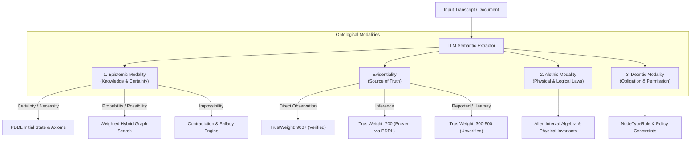

# PLAN: Ontological Modality Filtering & Evidentiality Tracking System

> [!IMPORTANT]
> **Implementation Status**: 🔴 **PLANNED / NOT IMPLEMENTED YET**
> - This document outlines the proposed architecture for **Ontological Modality Filtering (Epistemic, Alethic, Deontic)** and **Evidentiality Tracking** in GLLAM.
> - **Current Status**: Not implemented in the codebase yet.

---

## 1. Executive Summary & Objective

Standard RAG architectures and knowledge graphs treat all ingested claims as flat, equivalent facts. In real-world conversational memory and agentic reasoning, statements vary widely across **Three Core Ontological Modalities**:
1. **Epistemic Modality**: What is known, probable, possible, or impossible (including source evidentiality).
2. **Alethic Modality**: What is physically or logically necessary vs. contingent (natural laws, causal/temporal constraints).
3. **Deontic Modality**: What is obligatory, permitted, or prohibited (procedural rules, formatting constraints, security policies).

When non-fact expressions (such as speculative opinions, figurative analogies, or permissive preferences) are naively converted into binary state predicates, they risk leaking into deterministic reasoning engines (like STRIPS/PDDL planners), causing false state contradictions or unsolvable planning diagnostics.

This plan defines a comprehensive modal logic engine for GLLAM. By tagging every extracted node and relationship with **Epistemic**, **Alethic**, and **Deontic** modal properties, GLLAM will:
1. **Gate Solver Inputs**: Exclude speculative hearsay and analogies from deterministic PDDL state-space initializations.
2. **Enforce Physical & Deontic Invariants**: Separate hard physical laws (Alethic) and policy rules (Deontic) from dynamic fluid states.
3. **Ground Trust Weights**: Compute epistemic confidence dynamically from source provenance rather than arbitrary magic integers.
4. **Enhance Prompt Context**: Provide LLMs with clear modal labels (`[EPISTEMIC: DIRECT_OBSERVATION]`, `[DEONTIC: OBLIGATION]`, `[ALETHIC: NECESSITY]`) during RAG prompt assembly.

---

## 2. The Three Ontological Modalities & Evidentiality



### 2.1 Epistemic Modality (Degrees of Knowledge & Certainty)
Focuses on the truth status of a proposition relative to the system's state of knowledge:
- **Certainty / Necessity**: The proposition *must* be true based on established facts, direct execution logs, or strict deductive proofs. *(e.g., "The database migration has completed.")*
- **Probability**: The proposition is *likely* true, supported by strong statistical weight or corroborating links, but lacks absolute proof. *(e.g., "The server will likely time out under 10k RPS.")*
- **Possibility**: The proposition *could* be true; it is uncontradicted by current state data or active constraints. *(e.g., "The memory graph might contain the missing reference.")*
- **Impossibility**: The proposition *cannot* be true given active constraints, physical invariants, or temporal contradictions. *(e.g., "The file cannot exist in an unmounted volume.")*

#### Evidentiality (Source of Truth)
Closely tied to Epistemic Modality, tracking how information was acquired:
- **Direct Observation**: Verified directly by system sensors, API execution logs, or verified database state.
- **Inference**: Deduced algorithmically from other established data points (e.g., via PDDL solver or temporal interval calculation).
- **Reported / Hearsay**: Acquired from external user transcripts, third-party input, or unverified claims.

### 2.2 Alethic Modality (Physical & Logical Necessity)
Focuses on what is intrinsically necessary or impossible regardless of observer knowledge:
- **Logical Necessity**: Propositions that hold true in all possible worlds *(e.g., "A database cannot simultaneously exist and not exist")*.
- **Physical Necessity / Invariants**: Natural laws, causal chains, and temporal ordering constraints *(e.g., "Deployment must occur after code compilation" via Allen Interval Algebra)*.
- **Contingency**: Facts that happen to be true in the current state but could logically be otherwise *(e.g., "Service running on port 8080")*.

### 2.3 Deontic Modality (Obligation & Permission)
Focuses on procedural rules, mandates, permissions, and prohibitions governing agent behavior:
- **Obligation**: Mandatory requirements *(e.g., "The response MUST include a standard markdown table")*.
- **Permission**: Allowed actions or optional behaviors *(e.g., "The agent MAY expand search depth to 3 hops if seeds < 5")*.
- **Prohibition**: Explicit negative boundaries *(e.g., "DO NOT expose raw internal API tokens in logs")*.

### 2.4 Classification of Analogy Utterances
An **analogy utterance** (e.g. *"Grace said: 'Handling phishing is like trying to fix a flat tire at 80mph'"* or *"Vera compared solar panels to golden tiles"*) decomposes into **three distinct modal layers**:

1. **Evidentiality (Speech Act Fact)**:
   - **`Evidentiality: reported_hearsay`** (or `direct_observation` if logged from a live session).
   - The *historical event of the speaker uttering the analogy* is a grounded fact (`Epistemic: Certainty`).
2. **Epistemic Modality (Literal Non-Grounded Metaphor)**:
   - **`Epistemic: possibility` / `non_literal`**.
   - The *literal content of the vehicle domain* (*"fixing a flat tire at 80mph"*) is NOT an active physical state in the target world model.
   - **PDDL Solver Gating**: GLLAM inspects this tag and excludes the literal vehicle state from PDDL initial states `(:init)`, preventing false physical contradictions (e.g., preventing the planner from thinking Grace is literally driving a car).
3. **Alethic Modality (Relational / Structural Isomorphism)**:
   - **`Alethic: structural_isomorphism`**.
   - The analogy asserts a structural parallel between the **Tenor** (target concept: *phishing management*) and the **Vehicle** (metaphorical domain: *tire repair*), mapping shared relational attributes ($\text{HighRisk} \land \text{Urgent} \land \text{ExecutionInMotion}$).

---

## 3. Data Model Extensions (`pkg/memory/types.go`)

### 3.1 Go Type Definitions

```go
package memory

// 1. Epistemic Modality
type EpistemicModality string

const (
	ModalityCertainty   EpistemicModality = "certainty"
	ModalityProbability EpistemicModality = "probability"
	ModalityPossibility EpistemicModality = "possibility"
	ModalityImpossible  EpistemicModality = "impossibility"
)

// Evidentiality (Source Provenance)
type EvidentialityType string

const (
	EvidenceDirectObservation EvidentialityType = "direct_observation"
	EvidenceInference         EvidentialityType = "algorithmic_inference"
	EvidenceReported          EvidentialityType = "reported_hearsay"
)

// 2. Alethic Modality
type AlethicModality string

const (
	AlethicNecessary   AlethicModality = "necessary"   // Logical/physical invariant
	AlethicContingent  AlethicModality = "contingent"  // Fluid state fact
	AlethicImpossible AlethicModality = "impossible"  // Physically/logically impossible
)

// 3. Deontic Modality
type DeonticModality string

const (
	DeonticObligation  DeonticModality = "obligation"  // MUST
	DeonticPermission  DeonticModality = "permission"  // MAY
	DeonticProhibition DeonticModality = "prohibition" // MUST NOT
)

// Extend SemanticNode with Ontological Modality metadata
type SemanticNode struct {
	ID                string            `json:"id"`
	Name              string            `json:"name"`
	Type              string            `json:"type"`
	ContextPrompt     string            `json:"context_prompt"`
	TrustWeight       int               `json:"trust_weight"`
	TaxonomyPath      string            `json:"taxonomy_path"`
	IsCategory        bool              `json:"is_category"`
	CaveatSummary     string            `json:"caveat_summary,omitempty"`
	EpistemicModality EpistemicModality `json:"epistemic_modality,omitempty"`
	Evidentiality     EvidentialityType `json:"evidentiality,omitempty"`
	AlethicModality   AlethicModality   `json:"alethic_modality,omitempty"`
}

// Extend SemanticLink with Ontological Modality metadata
type SemanticLink struct {
	SourceID              string            `json:"source_id"`
	TargetID              string            `json:"target_id"`
	Relationship          string            `json:"relationship"`
	Caveats               string            `json:"caveats"`
	ValidFrom             string            `json:"valid_from"`
	ValidUntil            *string           `json:"valid_until"`
	TemporalAnchorID      string            `json:"temporal_anchor_id"`
	TemporalRelation      string            `json:"temporal_relation"`
	TemporalOffsetSeconds int64             `json:"temporal_offset_seconds"`
	TemporalGranularity   string            `json:"temporal_granularity"`
	TemporalNote          string            `json:"temporal_note"`
	OriginSourceID        string            `json:"origin_source_id"`
	RuleContext           string            `json:"rule_context"`
	ConstraintType        string            `json:"constraint_type"`
	RuleRationale         string            `json:"rule_rationale"`
	ResolutionRationale   string            `json:"resolution_rationale"`
	DurationTurns         int64             `json:"duration_turns"`
	RemainingTurns        int64             `json:"remaining_turns"`
	UpdatedAt             int64             `json:"updated_at"`
	EpistemicModality     EpistemicModality `json:"epistemic_modality,omitempty"`
	Evidentiality         EvidentialityType `json:"evidentiality,omitempty"`
	AlethicModality       AlethicModality   `json:"alethic_modality,omitempty"`
	DeonticModality       DeonticModality   `json:"deontic_modality,omitempty"`
}
```

### 3.2 Database Schema Migration (`pkg/memory/sqlite.go`)

Add modal columns to `semantic_nodes` and `semantic_links`:

```sql
ALTER TABLE semantic_nodes ADD COLUMN epistemic_modality TEXT DEFAULT 'certainty';
ALTER TABLE semantic_nodes ADD COLUMN evidentiality TEXT DEFAULT 'reported_hearsay';
ALTER TABLE semantic_nodes ADD COLUMN alethic_modality TEXT DEFAULT 'contingent';

ALTER TABLE semantic_links ADD COLUMN epistemic_modality TEXT DEFAULT 'certainty';
ALTER TABLE semantic_links ADD COLUMN evidentiality TEXT DEFAULT 'reported_hearsay';
ALTER TABLE semantic_links ADD COLUMN alethic_modality TEXT DEFAULT 'contingent';
ALTER TABLE semantic_links ADD COLUMN deontic_modality TEXT DEFAULT NULL;
```

---

## 4. Pipeline Instrumentation & Solver Gating

### 4.1 Semantic Extraction Prompting (`cmd/extract_semantics/main.go`)

Update extraction rules to map extracted text into the three ontological modalities:
- **Epistemic**: Tag analogies & conjectures as `possibility` + `reported_hearsay`. Tag verified facts as `certainty`.
- **Alethic**: Tag physical dependencies and temporal ordering as `alethic_modality: "necessary"`.
- **Deontic**: Tag rules, policies, and constraints as `obligation`, `permission`, or `prohibition`.

### 4.2 PDDL Solver Gating (`pkg/engine/pddl_compiler.go`)

```go
// Filter Graph Nodes for PDDL State Initialization
func CompileGraphToPDDLAspect(nodes []SemanticNode, links []SemanticLink, ...) (string, string) {
    var pddlInitNodes []SemanticNode
    for _, n := range nodes {
        // Exclude hearsay, analogies, and speculative claims from physical PDDL initial state
        if n.Evidentiality == EvidenceReported && n.EpistemicModality == ModalityPossibility {
            continue
        }
        pddlInitNodes = append(pddlInitNodes, n)
    }
    // ... compile remaining grounded nodes into PDDL domain and problem
}
```

### 4.3 Dynamic Trust Weight Calculation (`pkg/engine/semantic.go`)

Calculate `TrustWeight` dynamically based on modal parameters:

$$\text{TrustWeight} = \text{BaseWeight}(\text{Evidentiality}) \times \text{Factor}(\text{EpistemicModality}) \times (1 - 0.2 \cdot N_{\text{fallacy}})$$

- **BaseWeight**: `direct_observation` (900), `algorithmic_inference` (750), `reported_hearsay` (400).
- **Factor**: `certainty` (1.0), `probability` (0.8), `possibility` (0.5), `impossibility` (0.0).

---

## 5. Step-by-Step Implementation Roadmap

- [ ] **Step 1: Go Struct & Schema Migration**
  - Add modal types and constants for Epistemic, Alethic, and Deontic modalities to `pkg/memory/types.go`.
  - Add SQLite migration statements in `pkg/memory/sqlite.go`.
- [ ] **Step 2: Semantic Extractor Updates**
  - Update prompt templates in `cmd/extract_semantics/main.go` to categorize `epistemic_modality`, `evidentiality`, `alethic_modality`, and `deontic_modality`.
- [ ] **Step 3: PDDL Compiler Gating**
  - Update `CompileGraphToPDDLAspect` in `pkg/engine/pddl_compiler.go` to filter out non-grounded modal nodes.
- [ ] **Step 4: RAG Prompt Context Formatting**
  - Update `FormatSystemPrompt` in `pkg/engine/llm.go` to prepend clear modal badges (`[EPISTEMIC: DIRECT_OBSERVATION]`, `[DEONTIC: OBLIGATION]`, `[ALETHIC: NECESSITY]`).
- [ ] **Step 5: Verification & Benchmark Evaluation**
  - Run `eval_d7_qa` to verify performance on analogy queries, temporal reasoning, and contradiction diagnostics.
