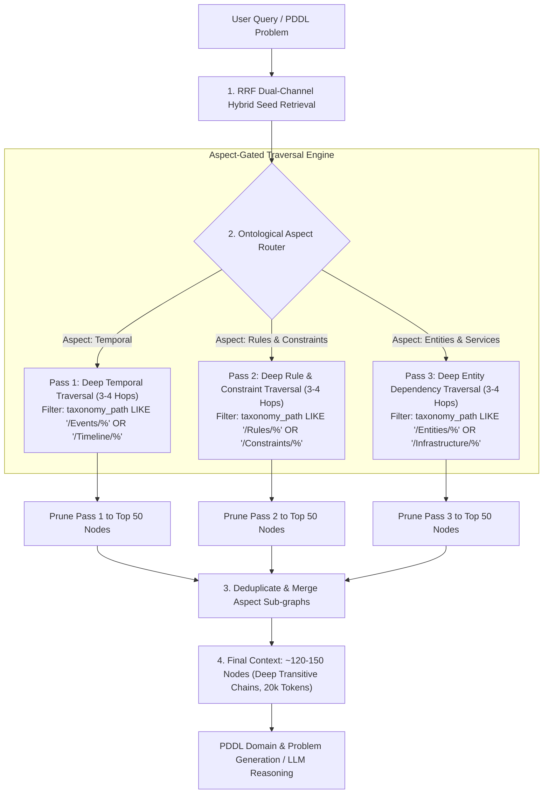

# PLAN: Ontologically-Gated Multi-Pass Graph Traversal Engine

> [!IMPORTANT]
> **Status**: 🟢 **PROPOSED ARCHITECTURE PLAN**
> - Solves the single-hop retrieval tradeoff in scale graphs (130,000+ nodes).
> - Executes deep 3-4 hop traversals along targeted **ontological concern paths** without context payload explosion.

---

## 1. Executive Summary & Problem Definition

In large-scale semantic graphs (130,000+ nodes, 190,000+ links):
- **Unconstrained Multi-Hop BFS**: Expanding 50 seed nodes 2-3 hops outward in all directions causes exponential payload explosion (9,000+ nodes, ~700,000 tokens), triggering OpenRouter context rejection (403 errors).
- **Static 1-Hop Truncation**: Capping traversal at 1 hop prevents prompt explosion but misses critical multi-hop transitive dependencies (e.g. `Event_A` $\rightarrow$ `Event_B` $\rightarrow$ `Event_C` $\rightarrow$ `Constraint_D`).

### The Solution: Ontologically-Gated Multi-Pass Traversal
Instead of an unconstrained single-pass expansion, GLLAM executes **targeted multi-pass traversals** scoped by **Ontological Concerns** (`taxonomy_path` branches and relationship categories):

1. **Pass 1 (Temporal Lineage & Events)**: Traverses 3-4 hops deep strictly along `/Events`, `/Timeline`, and `/StateTransitions` taxonomy paths and `happened_before`, `valid_from` edges.
2. **Pass 2 (Rules & Constraints)**: Traverses 3-4 hops deep strictly along `/Rules`, `/Constraints`, and `/Preferences` taxonomy paths and `has_constraint`, `is_preference` edges.
3. **Pass 3 (Domain Entities & Dependencies)**: Traverses 3-4 hops deep strictly along `/Entities`, `/Services`, and `/Infrastructure` taxonomy paths and `depends_on`, `has_state` edges.

Each pass produces a compact, aspect-specific sub-graph. When combined, the final context contains **deep transitive chains (3-4 hops)** across all key concerns while staying strictly bounded under **150 nodes (~20,000 tokens)**!

---

## 2. Multi-Pass Traversal Architecture



---

## 3. Core Go Data Structures & API Signatures

```go
package engine

import (
	"context"
	"github.com/laurentalsina/gllam/pkg/memory"
)

// OntologicalAspect defines the target concern boundary for a traversal pass
type OntologicalAspect string

const (
	AspectTemporalLineage OntologicalAspect = "temporal_lineage" // Events, timelines, sequence order
	AspectRuleConstraint  OntologicalAspect = "rule_constraint"   // User rules, security constraints, preferences
	AspectEntityState     OntologicalAspect = "entity_state"      // Physical/virtual entities, dependencies, states
)

// TraversalGate defines filtering criteria for an aspect pass
type TraversalGate struct {
	Aspect            OntologicalAspect
	TaxonomyPrefixes  []string // e.g. ["/Events", "/Timeline", "/StateTransitions"]
	AllowedRelations  []string // e.g. ["happened_before", "during_interval", "valid_from"]
	MaxDepth          int      // e.g. 3 or 4 hops
	NodeBudget        int      // e.g. 50 nodes per pass
}

// ExpandOntologicalAspectPass performs deep multi-hop traversal gated by a specific TraversalGate
func (e *GllamEngine) ExpandOntologicalAspectPass(
	ctx context.Context,
	seedNodes []memory.SemanticNode,
	seedLinks []memory.SemanticLink,
	gate TraversalGate,
) ([]memory.SemanticNode, []memory.SemanticLink, error)

// MultiPassOntologicalTraversal executes sequential aspect-gated passes and merges the sub-graphs
func (e *GllamEngine) MultiPassOntologicalTraversal(
	ctx context.Context,
	userQuery string,
	seedNodes []memory.SemanticNode,
	seedLinks []memory.SemanticLink,
) (*memory.CompiledContext, error)
```

---

## 4. Algorithmic Steps for `ExpandOntologicalAspectPass`

For a given seed node set $S$ and gate $G$:

1. **Frontier Initialization**: Set `frontier = seedNodes`, `visited = map[nodeID]bool`.
2. **Depth Loop (1 to $G.\text{MaxDepth}$)**:
   - For each node $u \in \text{frontier}$, query active links in SQLite:
     ```sql
     SELECT source_id, target_id, relationship, caveats, valid_from, valid_until, temporal_anchor_id
     FROM semantic_links
     WHERE (source_id = ? OR target_id = ?) AND valid_until IS NULL
     ```
   - **Relationship Gate**: Filter link $L$ where $L.\text{Relationship} \in G.\text{AllowedRelations}$.
   - **Taxonomy Gate**: Fetch neighbor node $v$. Allow expansion to $v$ only if $v.\text{TaxonomyPath}$ matches one of $G.\text{TaxonomyPrefixes}$ (or if $v$ is a direct structural antecedent).
   - Append valid neighbors to `nextFrontier`.
3. **Pass Pruning**: Sort nodes accumulated in Pass $k$ by PageRank / TrustWeight and cap at $G.\text{NodeBudget}$ (50 nodes).

---

## 5. Benefits Over Unconstrained BFS

| Metric | Unconstrained 2-Hop BFS | Ontologically-Gated Multi-Pass Traversal |
| :--- | :--- | :--- |
| **Max Traversal Depth** | 1 hop (forced cut-off) | **3 to 4 hops deep** along relevant concern paths |
| **Context Node Count** | 9,200 nodes (uncontrolled) | **~120-150 nodes** (bounded across 3 passes) |
| **Prompt Token Size** | ~700,000 tokens (403 Error) | **~20,000 tokens** (Fits in any context window) |
| **Transitive Chain Recall** | Low (misses 2+ hop chains) | **High** (recalls deep 3+ hop dependency chains) |
| **Noise Contamination** | High (bleeds into unrelated domains) | **Zero** (taxonomy paths gate out irrelevant branches) |

---

## 6. Verification Plan

1. **Unit Tests (`pkg/engine/router_multipass_test.go`)**:
   - Create synthetic graph with 4-hop temporal chain (`A -> B -> C -> D`) and unrelated nodes.
   - Run `ExpandOntologicalAspectPass` with `AspectTemporalLineage`. Assert `D` (4th hop) is retrieved while unrelated nodes are gated out.
2. **PDDL Evaluation Benchmark (`cmd/eval_d7_qa`)**:
   - Evaluate `d7_qa` benchmark using `MultiPassOntologicalTraversal`.
   - Assert transitive multi-hop questions achieve higher accuracy without 403 content filter errors.
