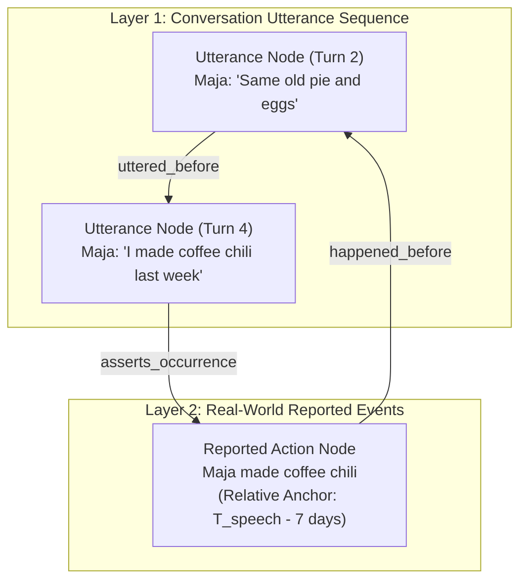

# PLAN: Temporal Speech-Act vs. Reported Event Ontology

> [!IMPORTANT]
> **Implementation Status**: 🟡 **PARTIALLY IMPLEMENTED**
> - ✅ **Implemented**: `origin_source_id` schema column & migrations (`schema.sql`, `engine.go`), Source-attributed link resolution & speaker disambiguation (`semantic.go`).
> - 📋 **Planned**: Dual-layer PDDL timeline separation (`utterance_timeline` vs `real_world_timeline`).

## 1. Executive Summary & Objective

A major source of reasoning failure in dialogue memory benchmarks occurs when the engine conflates **Speech Act Utterances** (the moment a statement is spoken in a conversation) with **Reported Events** (the past occurrences referenced inside the speech act).

For example, when a speaker says in Turn 4: *"I made coffee chili last week"*:
- **Utterance Event ($E_{\text{speech}}$)**: Occurred at Turn 4 ($T_{\text{speech}} = \text{Turn 4}$).
- **Reported Event ($E_{\text{action}}$)**: Occurred in the real world 7 days prior ($T_{\text{action}} = T_{\text{speech}} - 7\text{ days}$).

When questions ask: *"Did X do A before or after mentioning B?"*, confusing $E_{\text{speech}}$ with $E_{\text{action}}$ results in self-contradictory answers (e.g. claiming an action happened in the past before a conversation, but concluding it happened after).

This plan defines a **Dual-Layer Temporal Graph Ontology** and **Disambiguated PDDL Representation** that explicitly distinguishes Utterance Events from Reported Past Events.

---

## 2. Dual-Layer Temporal Graph Ontology

### 2.1 Three-Way Temporal Grounding for Reported Events

Reported events are grounded in the graph using one of three explicit temporal qualifiers:

1. **Explicit Past Date**: Grounded by a fixed calendar timestamp (e.g. `valid_from = "2024-05-12"`).
2. **Relative Past Offset ($\Delta t$)**: Grounded relative to the speech act timestamp (e.g. `temporal_note = "last week"`, `temporal_anchor_id = "turn_4"`, `temporal_offset_seconds = -604800`).
3. **Event Precedence Anchor**: Grounded relative to another known event or statement (e.g. `temporal_relation = "before"`, `temporal_anchor_id = "event_diner_visit"`).

---

## 3. Relationship Link Types

| Relationship | Source Node | Target Node | Semantics |
| :--- | :--- | :--- | :--- |
| `asserts_occurrence` | Utterance Node ($E_{\text{speech}}$) | Reported Event ($E_{\text{action}}$) | Links speech act to the past event it claims happened. |
| `uttered_before` | Utterance Node $A$ | Utterance Node $B$ | Sequential order of dialogue turns in the transcript. |
| `happened_before` | Reported Event $A$ | Reported Event $B$ | Real-world chronological order of physical events. |

---

## 4. Prompt & PDDL Disambiguation Guidelines

### 4.1 Extraction Prompt Guidelines (`cmd/extract_semantics/main.go`)
Update semantic extraction instructions:
- When a speaker mentions an event that happened in the past (e.g., *"last week"*, *"yesterday"*, *"before the war"*), extract:
  1. A `human` / `utterance` node for the speech act.
  2. An `event` / `state` node for the reported past occurrence.
  3. An `asserts_occurrence` link connecting the speech act to the reported event with `temporal_offset_seconds` or `temporal_note`.

### 4.2 Query Routing & Prompt Assembly (`pkg/engine/router.go`)
Update system prompt context assembly rules:
- **Disambiguation Rule**:
  - If a question asks: *"Did X **do / make** A before or after **mentioning / saying** B?"*:
    - Compare $T_{\text{action}}(A)$ (real-world event time) against $T_{\text{speech}}(B)$ (conversation turn time).
  - If a question asks: *"Did X **mention / say** A before or after **mentioning / saying** B?"*:
    - Compare $T_{\text{speech}}(A)$ against $T_{\text{speech}}(B)$ (turn sequence order).

---

## 5. Implementation Steps (Post-Benchmark)

1. **Step 1: Schema & Link Types (`pkg/memory/types.go`)**
   - Add `RelationshipAssertsOccurrence`, `RelationshipUtteredBefore`, `RelationshipHappenedBefore`.

2. **Step 2: Extractor System Prompt Update (`cmd/extract_semantics/main.go`)**
   - Instruct LLM to separate speech acts from past reported events during extraction.

3. **Step 3: PDDL Goal & Aspect Projection (`pkg/engine/pddl_compiler.go`)**
   - Project `AspectTemporal` into two separate PDDL timelines: `utterance_timeline` and `real_world_timeline`.

4. **Step 4: Router Prompt Guidance (`pkg/engine/router.go`)**
   - Add explicit system prompt instructions distinguishing utterance timestamps from reported event timestamps.

---

## 6. Verification Criteria

- [ ] Ingestion of "I made chili last week" creates distinct `utterance` and `reported_event` nodes linked by `asserts_occurrence`.
- [ ] Questions asking about *mention order* receive answers based on turn order ($T_{\text{speech}}$).
- [ ] Questions asking about *action order* receive answers based on real-world event time ($T_{\text{action}}$).
- [ ] `TestSpeechActVsReportedEvent` unit test suite passes with 100% precision.
