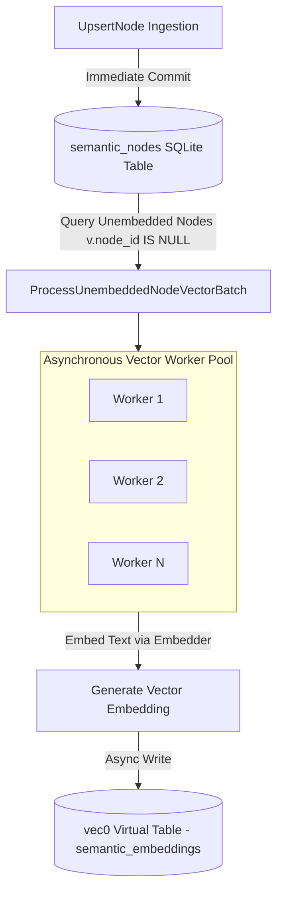

# Asynchronous Vector Index Worker Pool Architecture Plan

## Overview

When scaling past 100,000 extracted `semantic_nodes`, executing embedding model inference and updating virtual vector tables (`sqlite-vec` `vec0`) inside the primary write transaction drastically increases commit latency.

The **Asynchronous Vector Index Worker Pool** decouples relational graph insertion from vector virtual table mutations. Relational nodes and links are committed to SQLite immediately (sub-millisecond latency), while vector embeddings are generated and indexed by background worker goroutines.

---

## Architectural Workflow



### 1. Decoupled Ingestion
* `UpsertNode` synchronously writes `semantic_nodes` relational records without blocking on embedding model calls or vector virtual table updates.

### 2. Unindexed Vector Discovery (`ProcessUnembeddedNodeVectorBatch`)
* Efficiently queries unindexed nodes using an outer join:
  ```sql
  SELECT n.id, n.name, n.context_prompt
  FROM semantic_nodes n
  LEFT JOIN semantic_embeddings v ON n.id = v.node_id
  WHERE v.node_id IS NULL
  LIMIT 50;
  ```

### 3. Asynchronous Worker Pool (`StartVectorEmbeddingWorkerPool`)
* Launches $N$ concurrent worker goroutines that periodically fetch batches of unindexed nodes.
* Computes vector embeddings via `e.embedder.Embed(ctx, text)`.
* Writes vector blobs into `semantic_embeddings` via `IndexNodeVector`.

---

## Verification Strategy

* **Unit Tests (`pkg/engine/vector_worker_test.go`):**
  * `TestAsynchronousVectorWorkerPool`:
    * Bulk inserts 20 `semantic_nodes` without synchronous vector embedding.
    * Asserts relational nodes exist in SQLite immediately while vector index count is initially 0.
    * Launches worker pool (`StartVectorEmbeddingWorkerPool`).
    * Asserts all 20 nodes are indexed into `semantic_embeddings` asynchronously.
