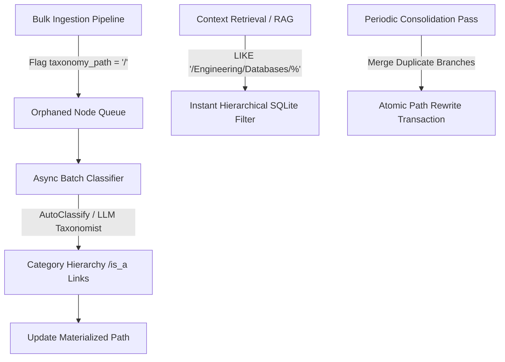

# Autonomous Ontological Layer (Materialized Paths & Self-Healing Taxonomy) Architecture Plan

## Overview

When ingesting large-scale enterprise corpora (15,000+ Jira issues, 10,000+ Confluence pages, Git repositories), a flat semantic graph quickly devolves into an unsearchable hairball. Without hierarchical category awareness, an engine cannot perform domain-isolated reasoning or filter out irrelevant subgraphs during context assembly.

The **Autonomous Ontological Layer** introduces a lightweight, zero-dependency hierarchical classification system in Go and SQLite using **Materialized Paths**.

---

## Data Model & Schema Modifications

### 1. SQLite Table Adjustments (`semantic_nodes`)
```sql
ALTER TABLE semantic_nodes ADD COLUMN taxonomy_path TEXT DEFAULT '/';
ALTER TABLE semantic_nodes ADD COLUMN is_category INTEGER DEFAULT 0;

CREATE INDEX idx_semantic_nodes_taxonomy_path ON semantic_nodes(taxonomy_path);
CREATE INDEX idx_semantic_nodes_is_category ON semantic_nodes(is_category);
```

* `taxonomy_path`: Stores materialized tree lineage (e.g., `/Engineering/Infrastructure/Databases/Relational/Postgres`).
* `is_category`: Flag distinguishing category nodes (`NodeTypeCategory = "category"`) from instance nodes.
* `semantic_links`: Ontological relationships (`relationship IN ('is_a', 'subclass_of', 'instance_of', 'part_of')`).

---

## Core Components & Workflows



### 1. Instantaneous Hierarchical Filtering
Querying nested trees without expensive recursive CTEs:
```sql
SELECT id, name, type, context_prompt, trust_weight, taxonomy_path
FROM semantic_nodes
WHERE taxonomy_path LIKE '/Engineering/Infrastructure/Databases/%'
ORDER BY taxonomy_path ASC;
```

### 2. Asynchronous Classification Worker (`ProcessUncategorizedBatch`)
Decouples taxonomy management from the main ingestion loop:
* Queries orphaned nodes (`taxonomy_path = '/'`).
* Maps entities to category profiles, generating parent category nodes as needed.
* Upserts category nodes and creates explicit `is_a` links in `semantic_links`.

### 3. Cyclic Parent-Child Path Prevention (`DetectTaxonomyCycles` & `WouldCreateTaxonomyCycle`)
Prevents LLM-generated taxonomy loops (e.g. `/Infrastructure/Storage` $\rightarrow$ `/Storage/Databases` $\rightarrow$ `/Infrastructure/Storage`):
* Uses **Kahn's Topological Sort Algorithm** to detect cycles across all `is_a`, `subclass_of`, `instance_of`, and `part_of` directed edges.
* `WouldCreateTaxonomyCycle(childID, parentID)` verifies reachable paths before writing edges or materialized paths.
* If a cycle is detected, the engine rejects the invalid parent assignment and routes the orphaned node to `/General/Unclassified`.

### 4. Self-Healing Taxonomy Consolidation (`ConsolidateTaxonomyBranch`)
Merges redundant categories (e.g. `/Engineering/DBs` $\rightarrow$ `/Engineering/Infrastructure/Databases`) in an atomic SQLite transaction:
1. Rewrites `taxonomy_path` string for all descendant nodes using `SUBSTR` and `REPLACE`.
2. Redirects `is_a`, `subclass_of`, `instance_of`, and `part_of` links to the canonical target category node.
3. Merges the old category node into the canonical target branch (`taxonomy_path = targetPath, is_category = 0`), preserving the node and its historical links in `semantic_nodes` without deletion.


### 4. Domain-Bound Procedural Memory (`GetProceduresByTaxonomyPrefix`)
Joins `procedural_knowledge` with `semantic_nodes` on `taxonomy_path LIKE '/Engineering/Infrastructure/Databases/%'` to retrieve operational recipes strictly relevant to the active domain.

---

## Verification Strategy

* **Unit Tests (`pkg/engine/taxonomy_test.go`):**
  * `TestAutonomousOntologicalLayer`: Verifies materialized path SQL queries, asynchronous classification, tree building, taxonomy consolidation, and domain procedural retrieval.
