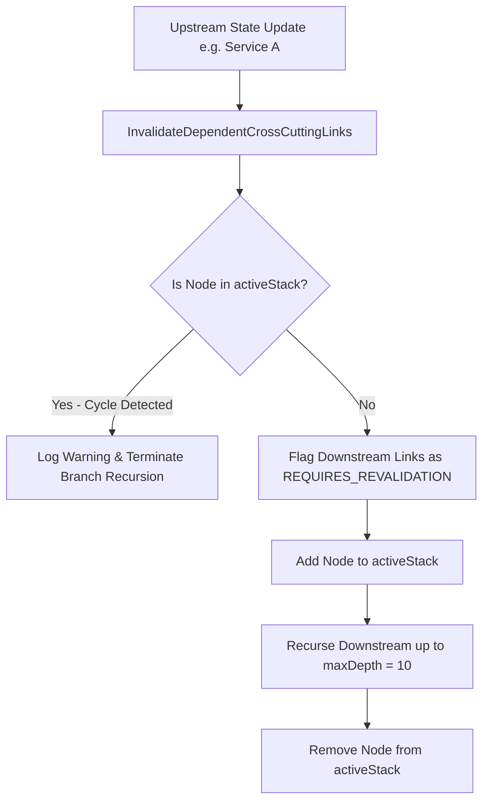

# Active Stack Cycle Detection & Cascading Invalidation Architecture Plan

## Overview

In enterprise datasets, complex circular dependencies exist across documents and components (e.g. `Service A` depends on `Spec B`, which applies `Rule C`, which references `Service A`).

When executing cross-cutting invalidation (`InvalidateDependentCrossCuttingLinks`), a state update on `Service A` triggers cascading invalidations across downstream links. Without active stack cycle detection, the engine risks entering an infinite recursive loop or accidentally expiring active, valid claims across the graph.

---

## Architectural Workflow

### 1. Active Stack Cycle Prevention
* `activeStack map[string]bool`: Tracks nodes currently being traversed in the active call stack branch.
* If `activeStack[currentNodeID] == true`, recursion down that branch immediately stops with a diagnostic warning, preventing infinite loops while allowing other acyclic branches to complete.

### 2. Configurable Dynamic Traversal Depth
* Replaces hard static depth caps with an unconstrained/configurable $N$-hop limit (default `remainingDepth = 10`), enabling deep dependency propagation across enterprise microservice trees.

---

## Verification Strategy

* **Unit Tests (`pkg/engine/knowledge_update_test.go`):**
  * `TestCircularDependencyInvalidationLoopPrevention`:
    * Seeds a circular dependency graph: `Service A` $\rightarrow$ `Spec B` $\rightarrow$ `Rule C` $\rightarrow$ `Service A`.
    * Triggers `InvalidateDependentCrossCuttingLinks` on `Service A`.
    * Asserts execution completes cleanly without infinite recursion or deadlocks, and links in the loop are tagged with `REQUIRES_REVALIDATION`.
