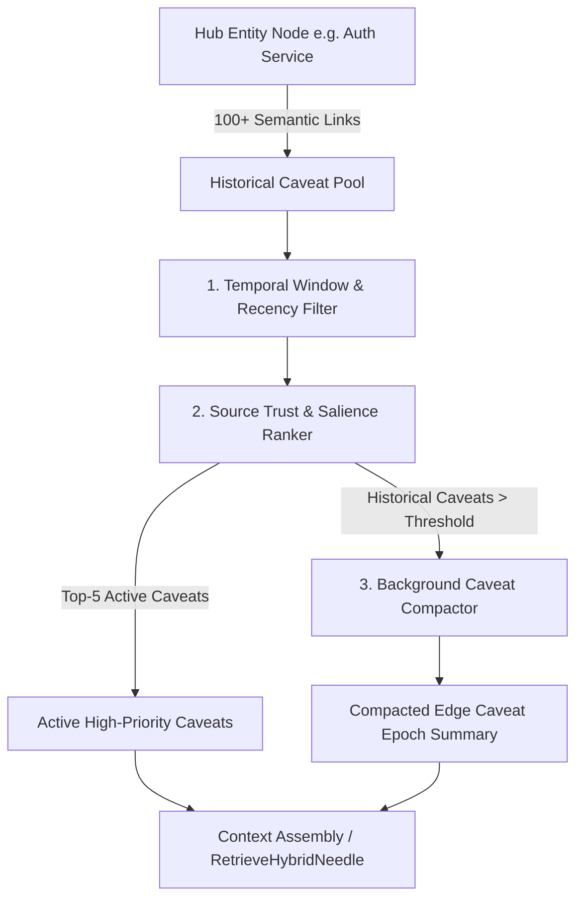

# Edge Caveat Compaction & Salience Windowing Architecture Plan

## Overview

Core enterprise entities (e.g. *"Auth Service"* or *"Production Database"*) accumulate hundreds of `semantic_links` with individual caveats across years of Jira tickets and emails. Injecting all these caveats into LLM context windows during RAG retrieval (`RetrieveHybridNeedle`) exhausts context budgets and causes reasoning confusion.

This feature introduces **Edge Caveat Compaction & Salience Windowing**, ranking active edge caveats while synthesizing historical caveat bloat into a node-level summary.

---

## Architectural Workflow



### 1. Schema & Data Model Adjustments
* **`semantic_nodes` Table:**
  ```sql
  ALTER TABLE semantic_nodes ADD COLUMN caveat_summary TEXT;
  ```
* `SemanticNode.CaveatSummary`: Stores synthesized historical caveat epochs.

### 2. Core Engine APIs
* **`CompactNodeEdgeCaveats(ctx context.Context, nodeID string, maxInline int) (string, int, int, error)`:**
  * Ranks node caveats by priority: Active (`valid_until IS NULL`) > Source Trust Weight > Recency.
  * Retains Top-K inline caveats (`maxInline = 5`).
  * Compacts remaining lower-priority/historical caveats into a synthetic `caveat_summary` text string stored on `semantic_nodes`.
* **`BatchCompactHubCaveats(ctx context.Context, caveatThreshold int, maxInline int) (int, error)`:**
  * Scans for enterprise hub nodes with $> \text{caveatThreshold}$ total edge caveats and executes compaction.

---

## Verification Strategy

* **Unit Tests (`pkg/engine/caveat_compaction_test.go`):**
  * `TestEdgeCaveatCompactionAndHubWindowing`:
    * Attaches 12 distinct edge caveats to `"node-auth-service"`.
    * Calls `CompactNodeEdgeCaveats` with `maxInline = 5`.
    * Asserts 5 active caveats retained inline, 7 historical caveats compacted into `caveat_summary`.
