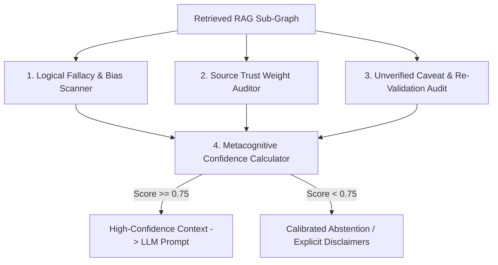

# Epistemic Self-Auditing Architecture Plan

## Overview

During RAG retrieval (`RetrieveHybridNeedle`), agents risk blindly incorporating low-trust claims, unverified caveats, or fallacious assumptions into their reasoning context. **Epistemic Self-Auditing** provides real-time metacognitive evaluation of retrieved graph sub-graphs, computing a quantitative `MetacognitiveConfidenceScore` ($\text{Score} \in [0.0, 1.0]$) and tagging questionable nodes before prompt assembly.

---

## Architectural Workflow



### 1. Source Trust & Fallacy Weighting
* **Trust Thresholding:** Flag links originating from sources with $W_{\text{trust}} < 300$ (e.g. unverified chat snippets or draft notes).
* **Fallacy Detection:** Intercepts `NodeTypeFallacy` connections (`post_hoc`, `begging_question`, `false_dilemma`) and downgrades link weights.

### 2. Metacognitive Confidence Calculation
```go
type EpistemicAuditResult struct {
	MetacognitiveConfidence float64  `json:"metacognitive_confidence"` // Range 0.0 - 1.0
	LowTrustNodeIDs         []string `json:"low_trust_node_ids"`
	FlaggedFallacies        []string `json:"flagged_fallacies"`
	RequiresRevalidation    bool     `json:"requires_revalidation"`
	AbstentionRecommended  bool     `json:"abstention_recommended"`
}
```

$$\text{Confidence} = \frac{\sum_{n \in \text{Nodes}} W_{\text{trust}}(n)}{N \cdot W_{\max}} \times (1 - 0.2 \cdot N_{\text{fallacy}}) \times (1 - 0.15 \cdot N_{\text{unrevalidated}})$$

---

## Verification Strategy

* **Unit Tests (`pkg/engine/epistemic_audit_test.go`):**
  * Test `AuditRetrievedEpistemicContext`: Verify confidence score drops when low-trust or fallacious nodes are present, recommending calibrated abstention when threshold is violated.
