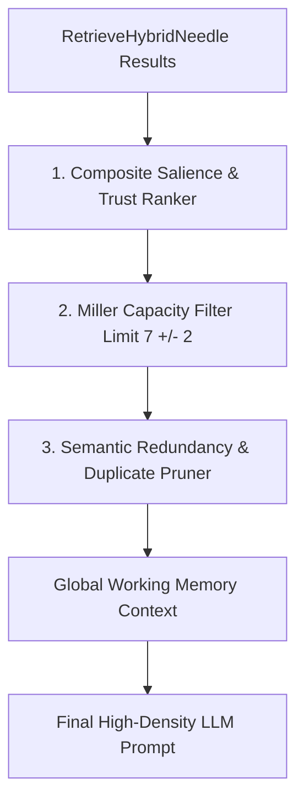

# Global Workspace Attention Gating Architecture Plan

## Overview

Overloading LLM context windows with hundreds of raw RAG retrieved nodes dilutes attention, increases context costs, and leads to rationale hallucination. Inspired by Cognitive Science's Global Workspace Theory, **Global Workspace Attention Gating** acts as a strict working memory bottleneck, filtering hybrid RAG results down to a high-salience working memory budget ($7 \pm 2$ core nodes).

---

## Architectural Workflow



### 1. Composite Salience Ranking
$$\text{Salience}(n) = \alpha \cdot \text{RRF\_Score}(n) + \beta \cdot \frac{W_{\text{trust}}(n)}{1000} + \gamma \cdot \text{RecencyScore}(n)$$

### 2. Miller Capacity Bottleneck ($7 \pm 2$)
* Enforces a hard budget constraint (default 7 core nodes, max 9) on the active working memory workspace.
* Suppresses low-salience noise and redundant sub-graph branches before context prompt formatting.

### 3. Data Model
```go
type GlobalWorkspaceContext struct {
	ActiveWorkingNodes []memory.SemanticNode `json:"active_working_nodes"`
	ActiveWorkingLinks []memory.SemanticLink `json:"active_working_links"`
	SuppressedCount    int                   `json:"suppressed_count"`
	CapacityBudget     int                   `json:"capacity_budget"`
}
```

---

## Verification Strategy

* **Unit Tests (`pkg/engine/attention_gating_test.go`):**
  * Test `GateGlobalWorkspaceAttention`: Verifies that a pool of 50 retrieved RAG nodes is filtered down to the Top-7 high-salience workspace nodes without losing critical entity relationships.
