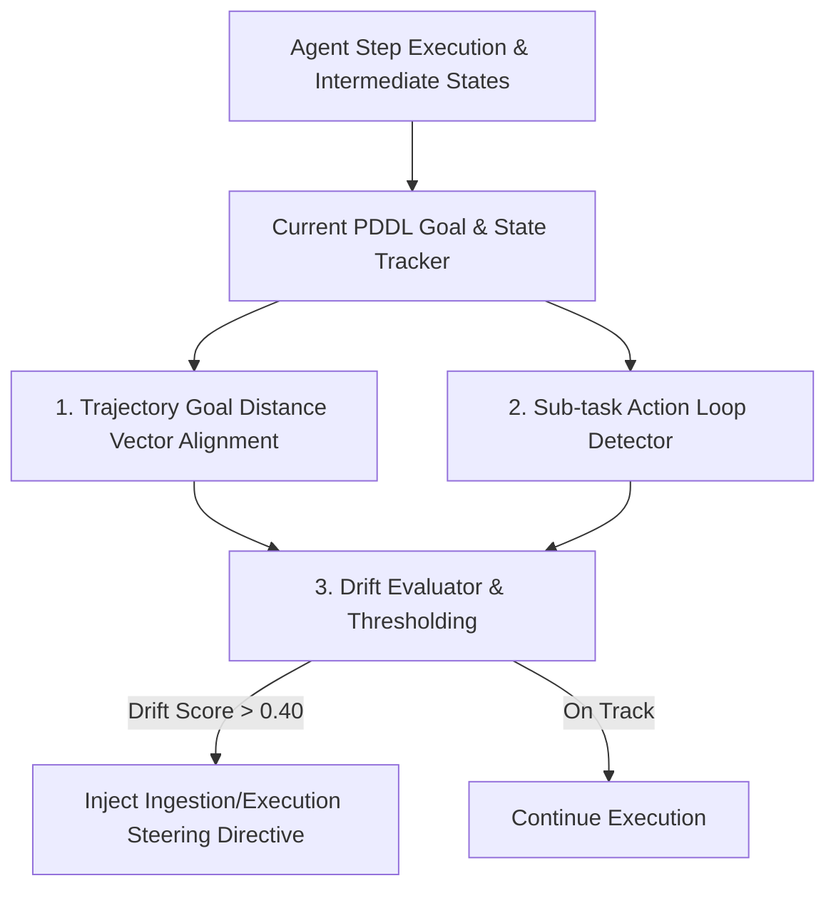

# Goal & Intent Drift Observer Architecture Plan

## Overview

During multi-step PDDL plan execution and long-running multi-turn agent interactions, agents can lose track of primary objectives, getting trapped in sub-task loops or deviating into irrelevant side-topics. The **Goal & Intent Drift Observer** monitors trajectory state against initial PDDL goals and user intent, triggering corrective steering directives when drift occurs.

---

## Architectural Workflow



### 1. Drift Metrics & Loop Detection
* **Distance Vector Metric:** Computes semantic cosine distance between initial PDDL goal state embedding and current trajectory state.
* **Action Loop Detection:** Identifies repeated action patterns (e.g. executing `check_status` $> 3$ consecutive times without state progress).

### 2. Steering Directive Data Model
```go
type GoalDriftReport struct {
	DriftScore          float64  `json:"drift_score"`           // 0.0 = aligned, 1.0 = completely drifted
	IsLoopingDetected   bool     `json:"is_looping_detected"`
	DetectedLoopAction  string   `json:"detected_loop_action"`
	SteeringDirective   string   `json:"steering_directive"`    // Injectable prompt steering rule
	RefocusRecommended  bool     `json:"refocus_recommended"`
}
```

---

## Verification Strategy

* **Unit Tests (`pkg/engine/drift_observer_test.go`):**
  * Test `DetectGoalAndIntentDrift`: Verifies detection of action loops and distance divergence from target PDDL goals.
