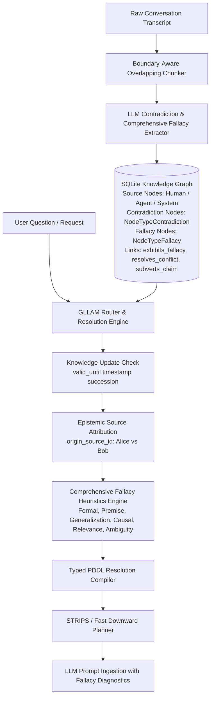

# Implementation Plan — Issue #2: Contradiction Resolution & Comprehensive Fallacy Handling

This plan outlines the architecture, data models, trap analysis, comprehensive fallacy taxonomy, and step-by-step implementation for **Issue #2: Contradiction Resolution** and **Milestone 2: Identify and Handle Fallacies (Byzantine Content Handling)**.

---

## Technical Architecture Overview

---

## Comprehensive Fallacy Taxonomy & Engine Impacts (Ref: Wikipedia List of Fallacies)

We group the full Wikipedia taxonomy into 6 major cognitive fallacy categories:

### 1. Formal & Propositional Fallacies (Logical Structure Errors)
* **Types:** `fallacy_affirming_consequent`, `fallacy_denying_antecedent`, `fallacy_syllogistic`, `fallacy_existential`.
* **Heuristic:** Deductive logic rule violations where the conclusion does not follow from true premises.
* **Engine Impact:** Invalidates PDDL action preconditions and disables cyclic state transitions.

### 2. Improper Premise & Presupposition Fallacies
* **Types:** `fallacy_begging_question` *(circular reasoning)*, `fallacy_false_dilemma` *(false dichotomy)*, `fallacy_complex_question`, `fallacy_false_equivalence`, `fallacy_suppressed_evidence`.
* **Heuristic:** Presupposes unproven conclusions, forces binary choices, or equates distinct concepts.
* **Engine Impact:** Prevents promoting unproven premises to `global` rules or `must_follow_rule` constraints.

### 3. Faulty Generalization & Statistical Fallacies
* **Types:** `fallacy_hasty_generalization`, `fallacy_cherry_picking`, `fallacy_survivorship_bias`, `fallacy_anecdotal`, `fallacy_slothful_induction`.
* **Heuristic:** Extrapolating universal claims from isolated, biased, or insufficient sample sizes.
* **Engine Impact:** Confines the rule scope (`rule_context`) to `session` or `source`, preventing global propagation.

### 4. Questionable Cause & Causal Fallacies
* **Types:** `fallacy_post_hoc` *(post hoc ergo propter hoc)*, `fallacy_cum_hoc` *(correlation $\neq$ causation)*, `fallacy_single_cause`, `fallacy_texas_sharpshooter`.
* **Heuristic:** Declaring causal relationships solely based on temporal order or coincidental spatial correlation.
* **Engine Impact:** Downgrades strict `causes` or `depends_on` links into weak `happened_before` temporal observations.

### 5. Relevance & Red Herring Fallacies (Poisoning & Distraction)
* **Types:** `fallacy_ad_hominem`, `fallacy_straw_man`, `fallacy_red_herring`, `fallacy_appeal_to_authority`, `fallacy_appeal_to_emotion`, `fallacy_tu_quoque`, `fallacy_moving_goalposts`, `fallacy_genetic`.
* **Heuristic:** Distracting from the core claim by attacking the speaker, misrepresenting claims, or shifting standards.
* **Engine Impact:** Redacts or deprioritizes poisonous agent outputs during RAG context assembly (`RouteAndAssemble`).

### 6. Ambiguity & Semantic Shift Fallacies
* **Types:** `fallacy_equivocation`, `fallacy_amphiboly`, `fallacy_composition`, `fallacy_division`, `fallacy_accent`.
* **Heuristic:** Using a polysemous term in multiple conflicting senses across premises or inferring whole-part identity.
* **Engine Impact:** Triggers `DisambiguateEntityForSource` to split ambiguous semantic nodes into distinct IDs.

---

## Detailed Analysis of Traps & Failure Modes

### Trap 1: Knowledge Update vs Genuine Contradiction
* **Issue:** Conflating a valid state change (*"DB upgraded from v14 to v15"*) with a contradiction (*"Session 1: DB is MySQL" vs "Session 2: DB is Postgres"*).
* **Solution:** Use temporal event anchors (`valid_from` / `valid_until`). If Fact B succeeded Fact A chronologically, it's a Knowledge Update. Only simultaneous conflicting claims trigger `NodeTypeContradiction`.

### Trap 2: Speaker Epistemic Disagreement vs Objective Fact Contradiction
* **Issue:** Alice says *"Service X is fast"*; Bob says *"Service X is slow"*.
* **Solution:** Leverage `origin_source_id`! Instead of marking the world state as broken, store source-attributed claims `(user_alice, claims, fast)` vs `(user_bob, claims, slow)`.

### Trap 3: Background Maintenance vs On-Request Resolution
* **Issue:** Forcing immediate resolution at extraction time when consensus is unknown.
* **Solution:** Maintain `has_unresolved_conflict` edges. When a user asks (*"Which database engine are we using?"*), trigger resolution diagnostics and present the exact conflict to the user.

### Trap 4: Logical Fallacies & Byzantine Inputs (Milestone 2 Integration)
* **Issue:** Treating logical fallacies as raw graph contradictions or valid constraints.
* **Solution:** Model `NodeTypeFallacy` as first-class cognitive nodes linked via `exhibits_fallacy` edges, appending explicit fallacy warnings in `FormatSystemPrompt`.

### Trap 5: Historical Resolution Traceability
* **Issue:** Deleting the incorrect claim upon resolution loses conversational history.
* **Solution:** Add `resolves_conflict` edges (`(claim_postgres, resolves_conflict, claim_mysql)`) with resolution rationale and timestamp.

---

## Proposed Implementation Phasing

1. **Phase 1: Schema & Data Model Updates** *(Completed - Commit 6b736aa)*
   * Added `NodeTypeFallacy` (`"fallacy"`) and `resolution_rationale`.

2. **Phase 2: Comprehensive Extraction Pipeline Prompting for Contradictions & Fallacies**
   * Update `cmd/extract_semantics/main.go` with all 6 major fallacy categories from Wikipedia (Formal, Premise, Generalization, Causal, Relevance, Ambiguity).

3. **Phase 3: Contradiction & Fallacy Resolution Engine**
   * Implement `ResolveContradiction(ctx, claimA, claimB, winningClaim, rationale)`.
   * Implement `DetectFallacySubversion(links, nodes)` for all 6 categories.

4. **Phase 4: Byzantine Fallacy Guarding & PDDL Aspect**
   * Exclude `fallacy` nodes from structural PDDL action preconditions.

5. **Phase 5: Automated Testing & Verification**
   * Write unit tests for contradiction resolution, fallacy heuristics across all 6 categories, and context sanitization.
