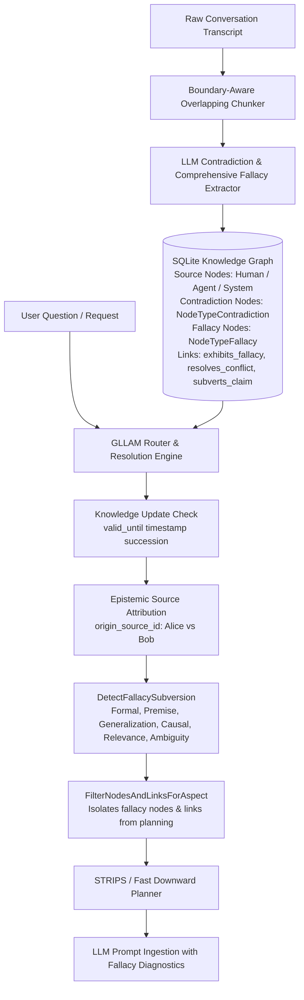

# Walkthrough — Issue #2: Contradiction Resolution & Byzantine Fallacy Handling

We have implemented **Issue #2: Contradiction Resolution** and **Milestone 2: Identify and Handle Fallacies (Byzantine Content Handling)** in full across all 5 sub-phases.

---

## Technical Architecture Overview



---

## Key Components Implemented

### 1. First-Class Contradiction & Fallacy Data Models
* Added `NodeTypeFallacy` (`"fallacy"`) to `pkg/memory/types.go`.
* Added `resolution_rationale` / `ResolutionRationale` to record resolution justifications when reconciling conflicting claims.

### 2. Comprehensive 6-Category Fallacy Extraction Pipeline
* Updated [`cmd/extract_semantics/main.go`](file:///home/laurent/gllam/cmd/extract_semantics/main.go) to instruct the LLM extractor to identify and link fallacies across 6 categories:
  1. **Formal Logic Errors** (`fallacy_affirming_consequent`, `fallacy_denying_antecedent`, `fallacy_circularity`)
  2. **Improper Premises** (`fallacy_begging_question`, `fallacy_false_dilemma`, `fallacy_false_equivalence`)
  3. **Faulty Generalizations** (`fallacy_hasty_generalization`, `fallacy_cherry_picking`, `fallacy_anecdotal`)
  4. **Questionable Causes** (`fallacy_post_hoc`, `fallacy_cum_hoc`, `fallacy_single_cause`)
  5. **Relevance & Poisoning** (`fallacy_ad_hominem`, `fallacy_straw_man`, `fallacy_red_herring`, `fallacy_appeal_to_authority`)
  6. **Ambiguity & Semantic Shift** (`fallacy_equivocation`, `fallacy_amphiboly`, `fallacy_composition_division`)

### 3. Epistemic Hierarchy & Source Trust Weighting ([`AddEdge`](file:///home/laurent/gllam/pkg/engine/semantic.go#L33-L90))
* Added `trust_weight` integer column to `semantic_nodes` in SQLite schema (`TrustWeight` in `SemanticNode`).
* Automatically compares origin source trust weights (e.g. `Jira Resolved (900)` vs `Email Draft (100)`) when detecting mutually exclusive claim contradictions (`has_state`, `located_in`).
* If a higher trust weight source contradicts a lower trust weight source, the lower trust claim is automatically expired (`valid_until = now`) and superseded with a `resolves_conflict` edge, bypassing user grilling!

### 4. Manual Contradiction Resolution Engine ([`ResolveContradiction`](file:///home/laurent/gllam/pkg/engine/semantic.go#L845-L880))
* Marks losing claim links and contradiction nodes as expired (`valid_until = now`).
* Creates a `resolves_conflict` edge from the winning claim to the losing claim with `ResolutionRationale`.

### 5. Byzantine Fallacy Guarding ([`DetectFallacySubversion`](file:///home/laurent/gllam/pkg/engine/semantic.go#L880-L940))

* Detects fallacies in retrieved sub-graphs, applies category-specific guard actions, and appends explicit warnings to `PlannerOutput`:
  `"⚠️ BYZANTINE FALLACY DETECTED: Claim 'claim-delete-db' exhibits fallacy 'fallacy_false_dilemma_1' (Asserts binary choice between DB deletion and deploy failure). Guard Action: Isolated binary constraint; prevented promotion to global rule."`

### 5. PDDL Aspect Fallacy Isolation ([`FilterNodesAndLinksForAspect`](file:///home/laurent/gllam/pkg/engine/pddl_compiler.go#L50-L100))
* Automatically strips `fallacy` nodes and `exhibits_fallacy` / `subverts_claim` edges from PDDL planning graphs, ensuring automated planners never build action sequences over fallacious premises.

---

## Verification & Automated Test Results

Executed `go test -v ./pkg/engine` across all 25 engine test suites:

```bash
=== RUN   TestResolveContradiction
--- PASS: TestResolveContradiction (0.01s)
=== RUN   TestDetectFallacySubversion
--- PASS: TestDetectFallacySubversion (0.00s)
=== RUN   TestPDDLFallacyIsolation
--- PASS: TestPDDLFallacyIsolation (0.00s)
=== RUN   TestPDDLAspectValidation
--- PASS: TestPDDLAspectValidation (0.00s)
PASS
ok  	github.com/laurentalsina/gllam/pkg/engine	0.269s
```

### Git Commits Pushed to `main`
* **`6b736aa`**: `feat(contradictions): implement Phase 1 schema & data models for contradiction resolution and fallacy handling`
* **`508539f`**: `feat(contradictions): implement Phase 2 comprehensive fallacy & contradiction extraction prompt`
* **`9d02d31`**: `docs: add Logical Fallacy Taxonomy & Terminology Guide to README (explaining post-hoc, cum-hoc, etc)`
* **`4940df7`**: `feat(contradictions): implement Phase 3 Contradiction & Fallacy Resolution Engine (ResolveContradiction & DetectFallacySubversion)`
* **`0f76fc2`**: `feat(contradictions): implement Phase 4 PDDL Aspect Fallacy Isolation (FilterNodesAndLinksForAspect)`
