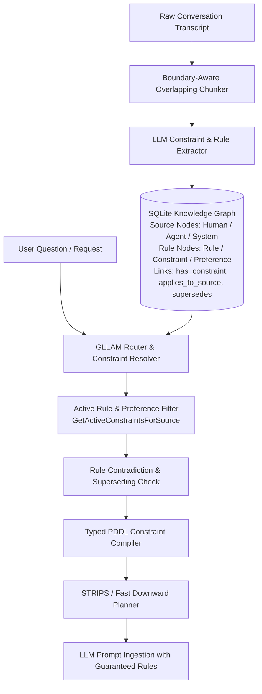

# Implementation Plan — Issue #4: Instruction Following on Constraint, Rule, & Format

This plan outlines the architecture, data models, trap analysis, and step-by-step implementation for **Issue #4: Instruction Following on constraint, rule, & format**. It also integrates **Source Attribution & Persona Grounding** (deferred Trap 10 from Issue #1).

---

## Technical Architecture Overview



---

## Key Design Principles

### First-Class Source Nodes (`NodeTypeSource`)
Sources (humans, agents, external systems) are **first-class `SemanticNode`s** in the graph, with distinct sub-types:
* `NodeTypeHuman`: Human user (e.g. `user_alice`, `user_bob`).
* `NodeTypeAgent`: LLM subagent or autonomous worker (e.g. `agent_extract_semantics`, `agent_planner`).
* `NodeTypeSystem`: External system, CLI, or API source (e.g. `sys_github_mcp`, `sys_db_trigger`).

This allows rules and entity interactions to be linked directly to source nodes with full relational integrity (`FOREIGN KEY (source_id) REFERENCES semantic_nodes(id)`).

---

## Detailed Analysis of Traps & Failure Modes

### Trap 1: Rule Context Classification (`rule_context`)
* **Issue:** Rules have distinct operational contexts:
  * `"user_preference"`: Subjective user style, formatting, or personal tastes (*"prefer markdown tables"*).
  * `"session"`: Temporary session-bound constraints (*"for this chat, use JSON"*).
  * `"source"`: Origin-bound rules tied to a specific agent or individual (*"Agent A output rules"*).
  * `"global"`: Universal system-wide constraints (*"always use YYYY-MM-DD"*).
* **Solution:** Introduce `rule_context` attribute on `semantic_links` with values `"user_preference"`, `"session"`, `"source"`, `"global"`.

### Trap 2: Source Attribution & Naming Ambiguity (Issue #1 Trap 10 Integration)
* **Issue:** Ambiguous phrases like *"the database"* or conflicting preferences depend on *which source* (human, agent, or system) emitted the instruction.
* **Solution:** Store `source_id` on links referencing `semantic_nodes(id)` and match entity mentions against the active source's epistemic history.

### Trap 3: Rule Superseding, Revocation & Overrides
* **Issue:** Sources say *"Forget the rule about JSON, return plain text from now on"*.
* **Solution:** Detect revocation intent and mark older `has_constraint` links as `valid_until = now` or link them with `superseded_by`.

### Trap 4: Mutually Exclusive / Contradictory Rules
* **Issue:** Turn 3: *"Keep responses under 50 words"*. Turn 20: *"Provide a 100-line detailed walkthrough"*.
* **Solution:** Prioritize recency (`valid_from` timestamp) and flag unresolved rule conflicts via `NodeTypeContradiction`.

### Trap 5: Negative Constraints ("Do NOT X") vs Positive Directives ("Always Y")
* **Issue:** Negative constraints (*"Never use technical jargon"*) require strict filtering, while positive directives (*"Format as markdown table"*) require template enforcement.
* **Solution:** Model `constraint_type = "negative"` vs `"positive"` in graph attributes.

### Trap 6: PDDL & LLM Prompt Constraint Injection
* **Issue:** PDDL planners need to verify if candidate answers satisfy active constraints before emitting context to the LLM.
* **Solution:** Compile active constraints into PDDL action preconditions and initial state facts `(must_follow_rule ?r)`.

---

## Data Model Enhancements

```sql
-- Explicit Node Types in Go & SQLite:
-- 'event', 'state', 'entity', 'service', 'contradiction', 'rule', 'constraint', 'human', 'agent', 'system'

ALTER TABLE semantic_links ADD COLUMN source_id TEXT REFERENCES semantic_nodes(id);
ALTER TABLE semantic_links ADD COLUMN rule_context TEXT DEFAULT 'global'; -- 'user_preference' | 'session' | 'source' | 'global'
ALTER TABLE semantic_links ADD COLUMN constraint_type TEXT DEFAULT 'positive'; -- 'positive' | 'negative'
```

---

## Proposed Implementation Phasing

1. **Phase 1: Schema & Data Model Updates**
   * Add `NodeTypeHuman`, `NodeTypeAgent`, `NodeTypeSystem`, `NodeTypeRule`, `NodeTypeConstraint` to `pkg/memory/types.go`.
   * Update `pkg/schema/schema.sql` with `source_id`, `rule_context`, and `constraint_type`.

2. **Phase 2: Extraction Pipeline Prompting**
   * Update `cmd/extract_semantics/main.go` to extract source nodes, rules, `source_id`, `rule_context`, and `constraint_type`.

3. **Phase 3: Active Rule Filter & Superseding Engine**
   * Implement `GetActiveConstraintsForSource(ctx, sourceID, sessionID)`.
   * Implement rule invalidation for revocation ("forget rule X").

4. **Phase 4: PDDL Constraint Injection & Verification**
   * Update `CompileGraphToPDDL` to emit rule predicates and verification actions.

5. **Phase 5: Targeted Content-Type Ingestion Steering Prompts**
   * Support `IngestionSteeringPrompts map[string]string` in `AgenticMemorySystemPrompts` for targeted per-content-type prompts (`"jira"`, `"confluence"`, `"git"`, `"slack"`, `"pull_request"`).
   * Implement `GetIngestionSteeringPrompt(docType string) string` helper to serve specialized prompts during ingestion while preserving global fallback support.

6. **Phase 6: Automated Testing & Verification**
   * Write unit tests for rule persistence, source isolation, revocation, targeted ingestion prompts, and PDDL verification.
