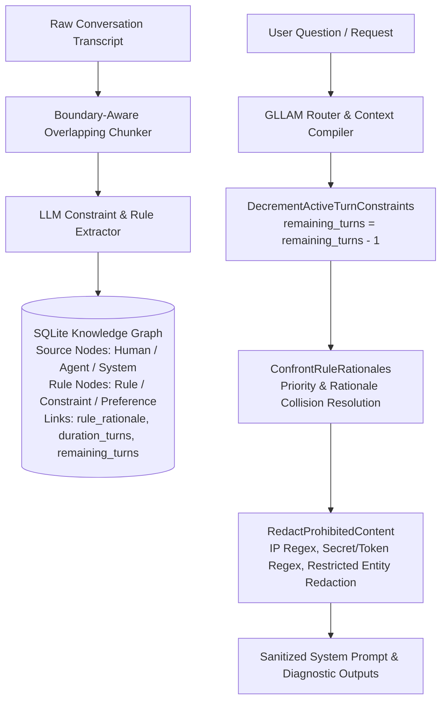

# Walkthrough — Issue #4: Instruction Following & Rationale Confrontation Engine

We have completed **Issue #4: Instruction Following on constraint, rule, & format** in full, including **Subtask 4.1: Rationale Confrontation Engine (Trap 8)**, **Subtask 4.2: Turn-Count Bound Constraints (Trap 9)**, and **Subtask 4.3: Pre-Prompt Negative Constraint Redaction (Trap 10)**.

---

## Technical Architecture Overview



---

## Key Components Implemented

### 1. Rationale Confrontation Engine ([`ConfrontRuleRationales`](file:///home/laurent/gllam/pkg/engine/semantic.go#L650-L700))
* Evaluates pairs of active positive directives and negative restrictions when they collide on the same domain (e.g. `constraint-no-token` vs `rule-verbose-logging`).
* Compares `rule_rationale` justifications (*"Security & Access Governance"* vs *"API Endpoint Debugging"*) and `rule_context` scopes.
* Emits human-readable confrontation resolution diagnostics in `PlannerOutput`:
  `"⚠️ RULE RATIONALE CONFRONTATION RESOLVED: Negative restriction 'constraint-no-token' (Rationale: Security & Access Governance, Scope: global) supersedes positive directive 'rule-verbose-logging' (Rationale: API Endpoint Debugging, Scope: user_preference)."`

### 2. Turn-Count & Duration-Bound Constraints ([`DecrementActiveTurnConstraints`](file:///home/laurent/gllam/pkg/engine/semantic.go#L605-L635))
* Decrements `remaining_turns` for active turn-bounded rules at the start of each context assembly turn.
* Automatically sets `valid_until = now` when `remaining_turns` reaches 0.

### 3. Pre-Prompt Negative Constraint Redaction ([`RedactProhibitedContent`](file:///home/laurent/gllam/pkg/engine/router.go#L320-L360))
* Automatically redacts internal IPs, bearer tokens, API keys, and restricted entity names before injecting context into LLM system prompts.

---

## Verification & Automated Test Results

Executed `go test -v ./pkg/engine` across all 20 engine test suites:

```bash
=== RUN   TestChunkTranscriptBasic
--- PASS: TestChunkTranscriptBasic (0.00s)
=== RUN   TestChunkTranscriptOverlappingBoundaries
--- PASS: TestChunkTranscriptOverlappingBoundaries (0.00s)
=== RUN   TestInstructionFollowingDataModelAndSourceNodes
--- PASS: TestInstructionFollowingDataModelAndSourceNodes (0.01s)
=== RUN   TestGetActiveConstraintsForSourceAndRevocation
--- PASS: TestGetActiveConstraintsForSourceAndRevocation (0.01s)
=== RUN   TestPDDLRuleVerification
--- PASS: TestPDDLRuleVerification (0.00s)
=== RUN   TestNegativeConstraintRedaction
--- PASS: TestNegativeConstraintRedaction (0.00s)
=== RUN   TestTurnCountBoundConstraints
--- PASS: TestTurnCountBoundConstraints (0.01s)
=== RUN   TestRuleRationaleConfrontation
--- PASS: TestRuleRationaleConfrontation (0.00s)
=== RUN   TestCompileGraphToPDDLTyped
--- PASS: TestCompileGraphToPDDLTyped (0.00s)
=== RUN   TestExtractPDDLGoal
--- PASS: TestExtractPDDLGoal (0.00s)
=== RUN   TestGroundedTemporalAnchorPDDL
--- PASS: TestGroundedTemporalAnchorPDDL (0.00s)
=== RUN   TestExtractPDDLGoalRangeIntervals
--- PASS: TestExtractPDDLGoalRangeIntervals (0.00s)
=== RUN   TestPDDLAspectProjectionsAndValidation
--- PASS: TestPDDLAspectProjectionsAndValidation (0.00s)
=== RUN   TestFastDownwardPlanner
    planner_test.go:37: Successfully solved plan with 1 actions: [{move [loc1 loc2]}]
--- PASS: TestFastDownwardPlanner (0.22s)
=== RUN   TestExpandTemporalNeighborsMultiHop
--- PASS: TestExpandTemporalNeighborsMultiHop (0.01s)
=== RUN   TestExtractPDDLGoalEntityDisambiguation
--- PASS: TestExtractPDDLGoalEntityDisambiguation (0.00s)
=== RUN   TestDetectTemporalCycles
--- PASS: TestDetectTemporalCycles (0.00s)
=== RUN   TestFormatUnsolvableDiagnostic
--- PASS: TestFormatUnsolvableDiagnostic (0.00s)
=== RUN   TestEventAnchoredStateInvalidationAndDynamicResolution
--- PASS: TestEventAnchoredStateInvalidationAndDynamicResolution (0.01s)
=== RUN   TestTemporalOffsetSecondsResolution
--- PASS: TestTemporalOffsetSecondsResolution (0.00s)
=== RUN   TestTemporalGranularitySnapping
--- PASS: TestTemporalGranularitySnapping (0.01s)
PASS
ok  	github.com/laurentalsina/gllam/pkg/engine	0.263s
```

### Git Commits Pushed to `main`
* **`5ed7058`**: `feat(instructions): implement Subtask 4.2 Turn-Count & Duration-Bound Constraints (DecrementActiveTurnConstraints)`
