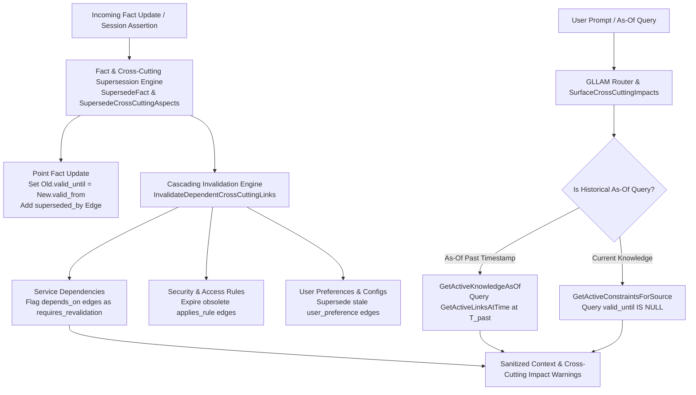

# Implementation Plan — Issue #5: Knowledge Update & Fact Revision (Cross-Cutting Concerns)

This plan outlines the architecture, data models, trap analysis, and step-by-step implementation for **Issue #5: Knowledge Update (KU)** — identifying when previously established facts have changed, maintaining `superseded_by` temporal evolution links, and handling **Cross-Cutting Concerns & Cascading Invalidation** across security, service dependencies, user rules, and epistemic source horizons.

---

## Technical Architecture Overview

---

## Audit of Pre-Existing Sub-Components & Overlaps

| Sub-Mechanism | Location in Codebase | Status | Reusability in Issue #5 |
| :--- | :--- | :--- | :--- |
| **State Expiration** | `pkg/engine/semantic.go` (`InvalidateObsoleteEdgeWithAnchor`) | ✅ **Already Implemented** | Sets `valid_until` timestamp on obsolete state edges. |
| **Rule Revocation & Supersession** | `pkg/engine/semantic.go` (`RevokeOrSupersedeRule`) | ✅ **Already Implemented** | Expire old rule link and insert `supersedes_rule` edge. |
| **Temporal Snapshot Retrieval** | `pkg/engine/semantic.go` (`GetActiveLinksAtTime`) | ✅ **Already Implemented** | Queries active links for any target Unix timestamp $T$. |

---

## Comprehensive Analysis of Traps & Failure Modes

### Trap 1: Fact Supersession vs Contradiction Conflation
* **Issue:** Treating a valid fact revision (*"Postgres upgraded to v15 in Feb"*) as an unresolved contradiction (`NodeTypeContradiction`), leaving both v14 and v15 active simultaneously.
* **Solution:** `SupersedeFact(ctx, oldLink, newLink, rationale)` — automatically sets `oldLink.valid_until = newLink.valid_from` and adds a `superseded_by` link connecting `newLink` to `oldLink`.

### Trap 2: Historical As-Of Query Blindness
* **Issue:** When asked *"What version of Postgres were we using LAST MONTH?"*, GLLAM returns the current updated version (v15) instead of the historically active version (v14).
* **Solution:** `GetActiveKnowledgeAsOf(ctx, timestamp)` — extracts temporal query targets (*"last month"*, *"on Jan 15"*) and queries `GetActiveLinksAtTime(ctx, T_past)`.

### Trap 3: Transitive Version Evolution Chains
* **Issue:** A fact is updated $N$ times ($V_1 \to V_2 \to V_3$). Traversal fails to trace the full evolution path.
* **Solution:** `GetFactEvolutionHistory(ctx, entityID, relationship)` — traverses `superseded_by` edges backwards to $V_1$, constructing a chronological changelog of how the fact evolved.

### Trap 4: Partial / Caveat Supersession Invalidation
* **Issue:** Updating a fact without invalidating obsolete attached caveats (e.g. $V_1$ had caveat *"only for read replica"*, $V_2$ removes read replica restriction).
* **Solution:** Propagate supersession to attached caveat edges, setting `valid_until` on obsolete caveats.

### Trap 5: Retroactive State Backdating (Out-of-Order Ingestion)
* **Issue:** Session 10 (Jan 15) is ingested *after* Session 12 (Feb 1). Naive code overwrites Feb 1 state with Jan 15 state!
* **Solution:** Compare `ValidFrom` timestamps before setting `valid_until`. If ingested fact $A$ is older than active fact $B$, set $A$'s `valid_until = B.ValidFrom` instead of overwriting $B$.

---

## 🌐 Cross-Cutting Concern Traps & Architectural Solutions

### Trap 6: Cascading Dependency Invalidation (Ripple Effect Blindness)
* **Issue:** Updating Node $A$ ($V_1 \to V_2$) leaves downstream services $B, C, D$ pointing to obsolete state assumptions about $A$'s capabilities or schema.
* **Solution:** `InvalidateDependentCrossCuttingLinks(ctx, updatedNodeID, validFrom)` — when $A$ is superseded, automatically inspect 1-hop and 2-hop `depends_on`, `requires_config`, and `applies_rule` edges. Mark dependent links that conflict with $V_2$ as `requires_revalidation` or expire them (`valid_until = V2.valid_from`).

### Trap 7: Multi-Aspect Cross-Cutting Update Atomicity
* **Issue:** A migration updates state ($V_2$), but security constraints, environment variables, and procedural recipes associated with $V_1$ remain active because they were stored as separate links.
* **Solution:** `SupersedeCrossCuttingAspects(ctx, nodeID, newAspectLinks)` — groups state changes, rule revisions, and procedural recipe updates under a single `superseded_by` transaction link, ensuring atomic invalidation across state, instruction, and procedural aspects.

### Trap 8: Epistemic Horizon Cross-Notification Across Teams/Sources
* **Issue:** Backend team updates the API schema in Session 5. Frontend team in Session 8 continues making claims based on the old schema because their `origin_source_id` history hasn't ingested the Backend update.
* **Solution:** `SurfaceCrossCuttingImpacts(links, nodes, sourceID)` — when Frontend Lead Alice queries GLLAM about the API, GLLAM surfaces a **Cross-Cutting Knowledge Update Warning**:
  `"⚠️ CROSS-CUTTING KNOWLEDGE UPDATE: Backend Service 'api-gateway' was updated to OIDC in Session 5 by user-bob. Your frontend dependency 'auth-client' requires re-validation."`

---

## Proposed Implementation Phasing

1. **Phase 1: Fact Supersession Engine & Out-of-Order Backdating (`SupersedeFact`)**
   * Implement `SupersedeFact(ctx, oldLink, newLink, rationale)` in `pkg/engine/semantic.go`.
   * Add out-of-order ingestion backdating check (Trap 5).

2. **Phase 2: Cascading Dependency & Multi-Aspect Invalidation (`InvalidateDependentCrossCuttingLinks`)**
   * Implement `InvalidateDependentCrossCuttingLinks` and `SupersedeCrossCuttingAspects` in `pkg/engine/semantic.go`.
   * Expire or flag downstream `depends_on` and `applies_rule` edges as `requires_revalidation`.

3. **Phase 3: Cross-Cutting Impact Warnings & Router Integration (`SurfaceCrossCuttingImpacts`)**
   * Implement `SurfaceCrossCuttingImpacts` in `pkg/engine/semantic.go` and hook into `RouteAndAssemble`.

4. **Phase 4: Historical As-Of Query Resolver (`GetActiveKnowledgeAsOf`)**
   * Implement `GetActiveKnowledgeAsOf(ctx, query, timestamp)` in `pkg/engine/semantic.go`.

5. **Phase 5: Automated Testing & Verification**
   * Write unit tests `TestSupersedeFact`, `TestInvalidateDependentCrossCuttingLinks`, `TestSurfaceCrossCuttingImpacts`, and `TestGetActiveKnowledgeAsOf` in `pkg/engine/knowledge_update_test.go`.
