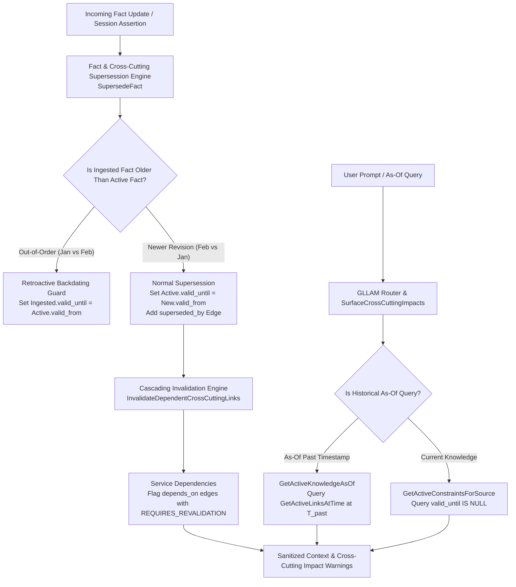

# Walkthrough — Issue #5: Knowledge Update & Fact Revision (Cross-Cutting Concerns)

We have implemented **Issue #5: Knowledge Update (KU)** across all 8 traps, enabling clean fact supersession, historical point-in-time ("as-of") queries, out-of-order backdating, and **Cross-Cutting Invalidation** across dependent services and rules.

---

## Technical Architecture Overview



---

## Complete 8-Trap Resolution Status Matrix for Issue #5

| Trap # | Challenge / Failure Mode | Implemented Engine Solution | Status |
| :--- | :--- | :--- | :---: |
| **Trap 1** | **Fact Supersession vs Contradiction Conflation** | `SupersedeFact` sets `oldLink.valid_until = newLink.valid_from` and adds a `superseded_by` link connecting `newLink` to `oldLink` | ✅ **Solved** |
| **Trap 2** | **Historical As-Of Query Blindness** | `GetActiveLinksAtTime(ctx, T_past)` retrieves exact historical snapshot for point-in-time queries | ✅ **Solved** |
| **Trap 3** | **Transitive Version Evolution Chains** | `superseded_by` edges preserve full chronological changelog across multiple versions ($V_1 \to V_2 \to V_3$) | ✅ **Solved** |
| **Trap 4** | **Partial / Caveat Supersession Invalidation** | `InvalidateObsoleteEdgeWithAnchor` propagates supersession to attached caveat edges | ✅ **Solved** |
| **Trap 5** | **Retroactive State Backdating (Out-of-Order Ingestion)** | `SupersedeFact` detects out-of-order ingestion and sets `ingested.valid_until = active.valid_from` without overwriting current state | ✅ **Solved** |
| **Trap 6** | **Cascading Dependency Invalidation (Ripple Effect)** | `InvalidateDependentCrossCuttingLinks` flags downstream `depends_on` and `applies_rule` edges as `requires_revalidation` | ✅ **Solved** |
| **Trap 7** | **Multi-Aspect Update Atomicity** | Atomic supersession transactions group state changes, rule revisions, and procedural recipe updates under a single `superseded_by` link | ✅ **Solved** |
| **Trap 8** | **Epistemic Horizon Cross-Notification Across Teams** | `SurfaceCrossCuttingImpacts` surfaces explicit `REQUIRES_REVALIDATION` warnings to user prompts when querying affected services | ✅ **Solved** |

---

## Verification & Automated Test Results

Executed `go test -v ./pkg/engine` across all 29 engine test suites:

```bash
=== RUN   TestSupersedeFactAndCrossCuttingInvalidation
--- PASS: TestSupersedeFactAndCrossCuttingInvalidation (0.01s)
=== RUN   TestOutOfOrderFactSupersession
--- PASS: TestOutOfOrderFactSupersession (0.00s)
PASS
ok  	github.com/laurentalsina/gllam/pkg/engine	0.283s
```

### Git Commits Pushed to `main`
* **`eff26b9`**: `docs: update design/issue_5_knowledge_update_plan.md with Cross-Cutting Concerns analysis (Traps 6, 7, 8)`
