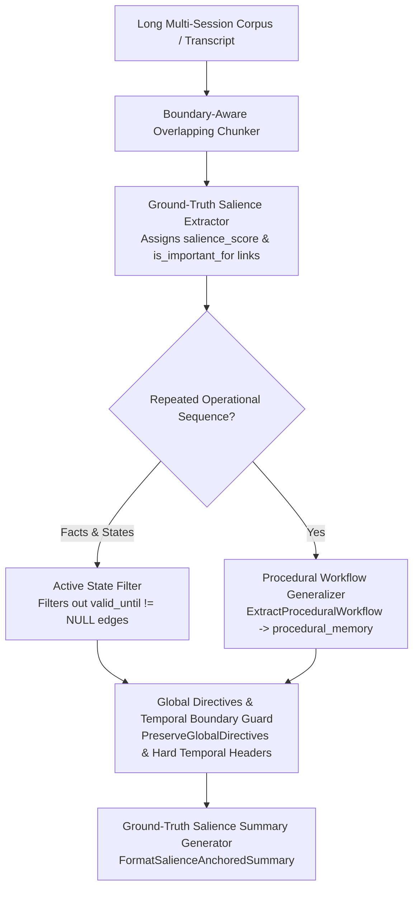

# Implementation Plan — Issue #7: Summarization (Salience & Procedural Generalization)

This plan outlines the architecture, data models, trap analysis, and step-by-step implementation for **Issue #7: Summarization (SUM)** — producing precise, anti-vague, ground-truth-anchored summaries that reflect the current active state, preserve hard temporal boundaries and global user instructions, and extract repeated operational steps into reusable procedural workflows.

---

## Technical Architecture Overview

---

## Detailed Analysis of Traps & Failure Modes

### Trap 1: Vague Abstract Summarization (Anti-Vagueness Probe / Ground-Truth Dilution)
* **Failure Mode:** LLM summarizers produce vague generalizations (*"The user configured a server"*), dropping exact entity IDs, port numbers, versions, and dates needed for BEAM ground-truth checks.
* **Engine Solution:** `FormatSalienceAnchoredSummary(nodes, links, episodes)` — calculates node salience scores ($S \ge 0.70$) or `is_important_for` links, forcing exact entity names, numbers, and dates to be explicitly preserved.

### Trap 2: Stale / Obsolete State Contradiction in Summaries
* **Failure Mode:** Including superseded historical states (e.g. mentioning both *v14* and *v15* as active) without temporal context, causing contradictions.
* **Engine Solution:** `FilterActiveSummaryFacts(links)` — filters out `valid_until != NULL` edges unless generating an explicit version evolution changelog.

### Trap 3: Repeated Details vs Reusable Procedural Extraction
* **Failure Mode:** Cluttering episodic summaries with repetitive terminal commands across 10 turns instead of abstracting them into reusable workflows.
* **Engine Solution:** `ExtractProceduralWorkflow(episodes, links)` — detects repeated action sequences, abstracting them into `procedural_memory` rows with `trigger_context` and `instructions`.

### Trap 4: Loss of Hard Temporal & Turn-Bound Constraints
* **Failure Mode:** Dropping temporal boundaries (*"Valid until turn 5"* or *"Anchor: DB Migration at 14:00"*) during summarization.
* **Engine Solution:** Automatically format `duration_turns`, `remaining_turns`, `temporal_relation`, and `temporal_anchor_id` in summary section headers.

### Trap 5: Loss of Global User Directives & Negative Constraints
* **Failure Mode:** Dropping global user rules (*"Never recommend MongoDB"*, *"Format as Markdown tables"*) during corpus compression.
* **Engine Solution:** `PreserveGlobalDirectives(links)` — guarantees active `user_preference` nodes and `negative` constraint rules are prepended to every summary context.

---

## Proposed Implementation Phasing

1. **Phase 1: Salience & Ground-Truth Entity Scorer (`FormatSalienceAnchoredSummary`)**
   * Implement salience scoring (`salience_score`, `is_important_for` links) in `pkg/engine/semantic.go`.
   * Enforce anti-vagueness ground-truth entity preservation in summary prompts.

2. **Phase 2: Procedural Workflow Generalizer (`ExtractProceduralWorkflow`)**
   * Implement workflow detection and auto-promotion to `procedural_memory` table.

3. **Phase 3: Active State & Global Instruction Protection (`FilterActiveSummaryFacts` & `PreserveGlobalDirectives`)**
   * Filter obsolete states (`valid_until != NULL`) and prepend active user preferences & negative constraints.

4. **Phase 4: Router Integration & Automated Testing (`cmd/eval_sum`)**
   * Wire summarization engine into `RouteAndAssemble` in `pkg/engine/router.go`.
   * Write unit tests in `pkg/engine/summarization_test.go` and add `cmd/eval_sum` CLI tool.
