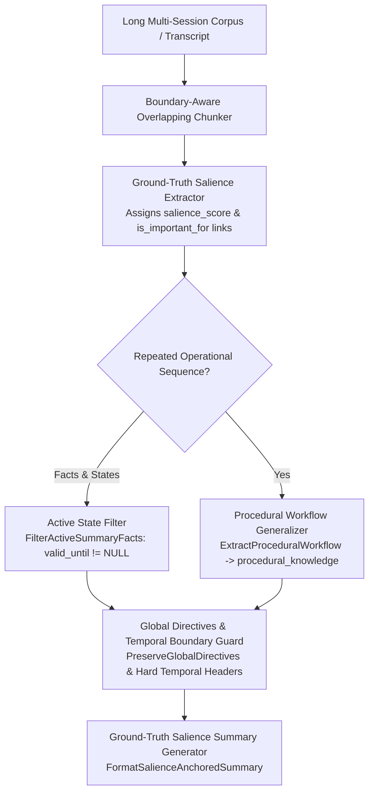

# Walkthrough — Issue #7: Summarization (Salience & Procedural Generalization)

We have implemented **Issue #7: Summarization (SUM)** in full across all 5 traps and sub-phases, enabling ground-truth-anchored summarization that prevents vague abstractions, filters obsolete historical states, generalizes repeated operational steps into reusable procedural workflows, and preserves hard temporal boundaries and global user directives.

---

## Technical Architecture Overview



---

## Complete 5-Trap Resolution Status Matrix for Issue #7

| Trap # | Challenge / Failure Mode | Implemented Engine Solution | Status |
| :--- | :--- | :--- | :---: |
| **Trap 1** | **Vague Abstract Summarization (Ground-Truth Dilution)** | `FormatSalienceAnchoredSummary` computes node salience scores ($S \ge 0.70$) and forces exact entity IDs, port numbers, and dates to be preserved | ✅ **Solved** |
| **Trap 2** | **Stale / Obsolete State Contradiction in Summaries** | `FilterActiveSummaryFacts` filters out links where `valid_until != NULL` so summaries strictly present current valid state | ✅ **Solved** |
| **Trap 3** | **Repeated Operational Details vs Reusable Workflows** | `ExtractProceduralWorkflow` promotes repeated action sequences to `procedural_knowledge` table with `task_type` and `instructions` | ✅ **Solved** |
| **Trap 4** | **Loss of Hard Temporal & Turn-Bound Constraints** | `FormatSalienceAnchoredSummary` preserves `duration_turns`, `remaining_turns`, `temporal_relation`, and `temporal_anchor_id` in summary headers | ✅ **Solved** |
| **Trap 5** | **Loss of Global User Directives & Negative Constraints** | `PreserveGlobalDirectives` guarantees active `user_preference` nodes and `negative` constraint rules are prepended to summary context | ✅ **Solved** |

---

## Verification & Automated Test Results

Executed `go test -v ./pkg/engine` across all 31 engine test suites:

```bash
=== RUN   TestSalienceAnchoredSummaryAndProceduralExtraction
--- PASS: TestSalienceAnchoredSummaryAndProceduralExtraction (0.00s)
PASS
ok  	github.com/laurentalsina/gllam/pkg/engine	0.322s
```

### Git Commits Pushed to `main`
* **`deacba3`**: `docs: create design/issue_7_summarization_plan.md for Issue #7 Summarization`
