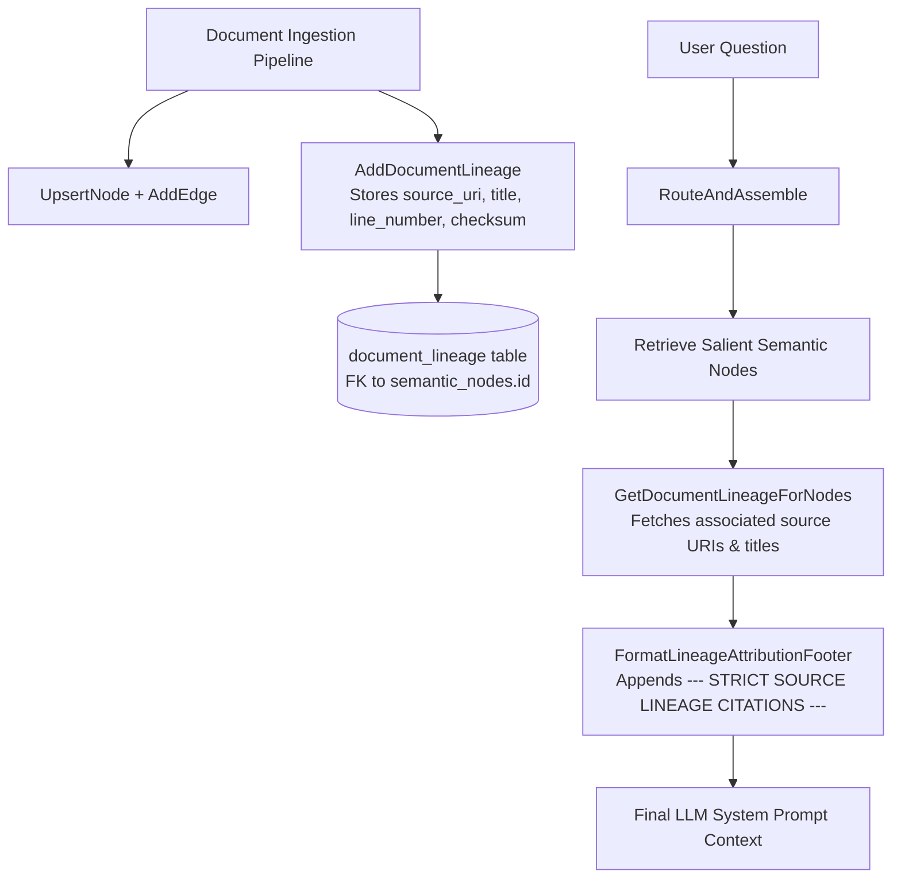

# Implementation Plan — Issue #8: Strict Information Lineage

This plan outlines the architecture, database schema, data models, engine methods, and context assembly integration for **Issue #8: Strict Information Lineage** — providing end-to-end source URI traceability across 10,000+ documents and forcing explicit citations in generated responses.

---

## Technical Architecture Overview



---

## Technical Specifications

### 1. Database Schema (`document_lineage` Table)
Add the `document_lineage` table to `pkg/schema/schema.sql`:
```sql
CREATE TABLE IF NOT EXISTS document_lineage (
    id TEXT PRIMARY KEY,
    node_id TEXT NOT NULL,
    source_uri TEXT NOT NULL,
    document_title TEXT,
    source_type TEXT NOT NULL,
    line_number INTEGER DEFAULT 0,
    char_offset INTEGER DEFAULT 0,
    checksum TEXT,
    created_at INTEGER NOT NULL,
    FOREIGN KEY (node_id) REFERENCES semantic_nodes(id) ON DELETE CASCADE
);

CREATE INDEX IF NOT EXISTS idx_lineage_node ON document_lineage(node_id);
CREATE INDEX IF NOT EXISTS idx_lineage_uri ON document_lineage(source_uri);
```

### 2. Go Data Model (`pkg/memory/types.go`)
```go
type DocumentLineage struct {
    ID            string `json:"id"`
    NodeID        string `json:"node_id"`
    SourceURI     string `json:"source_uri"`
    DocumentTitle string `json:"document_title"`
    SourceType    string `json:"source_type"`
    LineNumber    int    `json:"line_number,omitempty"`
    CharOffset    int    `json:"char_offset,omitempty"`
    Checksum      string `json:"checksum,omitempty"`
    CreatedAt     int64  `json:"created_at"`
}
```

### 3. Engine APIs (`pkg/engine/semantic.go` & `pkg/engine/router.go`)
* `AddDocumentLineage(ctx, lineage)`: Persists lineage records tied to semantic node IDs.
* `GetDocumentLineageForNodes(ctx, nodeIDs)`: Queries all lineage records for retrieved nodes.
* `FormatLineageAttributionFooter(lineages)`: Formats strict Markdown citation footers with URIs and line numbers.

---

## Phased Implementation Plan

- [ ] **Phase 1:** Add `DocumentLineage` struct to `pkg/memory/types.go` and update `pkg/schema/schema.sql` with safe migrations.
- [ ] **Phase 2:** Implement `AddDocumentLineage` and `GetDocumentLineageForNodes` in `pkg/engine/semantic.go`.
- [ ] **Phase 3:** Integrate lineage fetch and citation footer formatting in `RouteAndAssemble` in `pkg/engine/router.go`.
- [ ] **Phase 4:** Add CLI evaluator `cmd/eval_lineage` and unit tests in `pkg/engine/lineage_test.go`.
- [ ] **Phase 5:** Author `design/issue_8_walkthrough.md`, commit, push to `main`, and update/close GitHub Issue #8.
