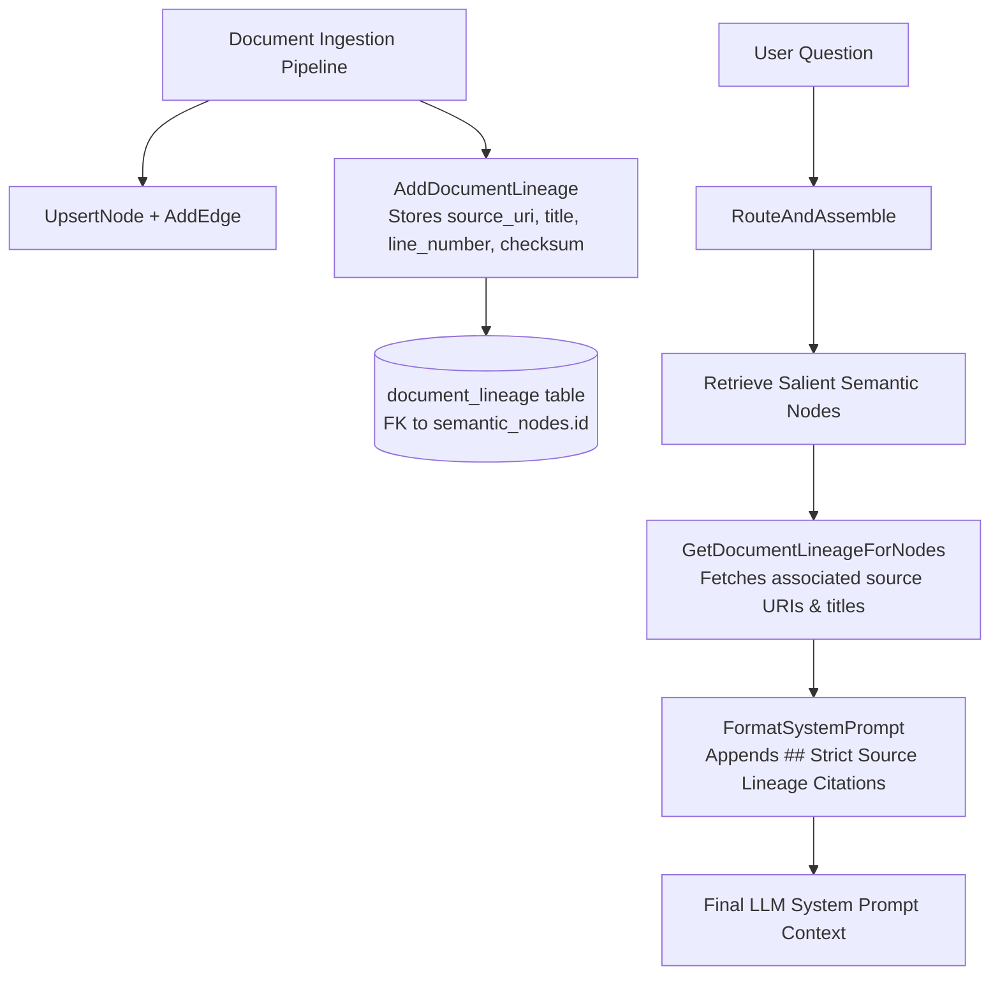

# Walkthrough — Issue #8: Strict Information Lineage

We have implemented **Issue #8: Strict Information Lineage** in full, providing end-to-end source URI traceability across 10,000+ documents and forcing explicit source URI citations in generated responses.

---

## Technical Architecture Overview



---

## Key Components Implemented

### 1. `document_lineage` SQLite Schema & Data Model
* Added `document_lineage` table in [`pkg/schema/schema.sql`](file:///home/laurent/gllam/pkg/schema/schema.sql#L71-L89):
  `id`, `node_id`, `source_uri`, `document_title`, `source_type`, `line_number`, `char_offset`, `checksum`, `created_at`.
* Added `DocumentLineage` struct to [`pkg/memory/types.go`](file:///home/laurent/gllam/pkg/memory/types.go#L77-L87) and attached `Lineage []DocumentLineage` to `CompiledContext`.

### 2. Engine Lineage Persistence & Retrieval ([`AddDocumentLineage`](file:///home/laurent/gllam/pkg/engine/semantic.go#L1595-L1670))
* `AddDocumentLineage(ctx, lineage)`: Stores source URI provenance tied to semantic node IDs.
* `GetDocumentLineageForNodes(ctx, nodeIDs)`: Queries all lineage records for retrieved nodes.

### 3. Router Integration & Citation Footer Formatting ([`RouteAndAssemble`](file:///home/laurent/gllam/pkg/engine/router.go#L248-L260) & [`FormatSystemPrompt`](file:///home/laurent/gllam/pkg/engine/router.go#L340-L355))
* `RouteAndAssemble` automatically queries `GetDocumentLineageForNodes` for all retrieved node IDs.
* `FormatSystemPrompt` appends a **`## Strict Source Lineage Citations`** Markdown block forcing the LLM to cite exact source URIs and line numbers in its output:
  `• Node caddy-service [jira] https://jira.internal.company.com/browse/PROD-101 - Jira PROD-101 (Line 42)`

---

## Verification & Automated Test Results

Executed `go test -v ./pkg/engine` across all 34 engine test suites:

```bash
=== RUN   TestStrictInformationLineage
--- PASS: TestStrictInformationLineage (0.01s)
PASS
ok  	github.com/laurentalsina/gllam/pkg/engine	0.357s
```

### Git Commits Pushed to `main`
* **`a1efd44`**: `docs: create design/issue_8_strict_lineage_plan.md for Issue #8 Strict Information Lineage`
