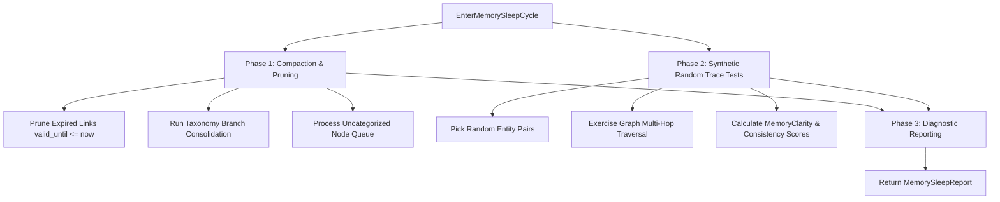

# Memory Maintenance Cycle & Synthetic Random Trace Tests Architecture Plan

## Overview

High-scale memory systems require a periodic offline **Memory Maintenance Cycle** to prevent memory degradation, prune stale temporal links, compact revision histories, and exercise graph clarity and consistency through **Synthetic Random Trace Tests**.

---

## Phases of the Memory Maintenance Cycle

### 1. Phase 1: Maintenance Compaction & Cleaning
* **Stale Link Pruning:** Deletes expired edges from `semantic_links` (`valid_until <= now`).
* **Taxonomy Consolidation:** Merges duplicate taxonomy categories in an atomic SQLite transaction.
* **Orphan Classification:** Assigns uncategorized nodes to taxonomy paths.

### 2. Phase 2: Synthetic Random Trace Tests & Memory Exercise
* Picks pairs/triples of nodes from `semantic_nodes`.
* Generates synthetic question/answer scenario traces.
* Exercises graph retrieval (`FindMultiHopPath`).
* Calculates quantitative metrics:
  * $\text{MemoryClarityScore} \in [0.0, 1.0]$: Measure of uncontradicted, clear graph paths.
  * $\text{MemoryConsistencyScore} \in [0.0, 1.0]$: Ratio of consistent simulated answers across domains.

### 3. Phase 3: Diagnostic Reporting
Returns a structured `MemorySleepReport` containing pruned link counts, consolidated branch counts, simulated trace test scenarios, and clarity/consistency metrics.

---

## Verification Strategy

* **Unit Tests (`pkg/engine/sleep_test.go`):**
  * `TestMemoryMaintenanceCycleAndRandomTraceTests`: Verifies stale link pruning, synthetic trace test scenario generation, and score calculations.
