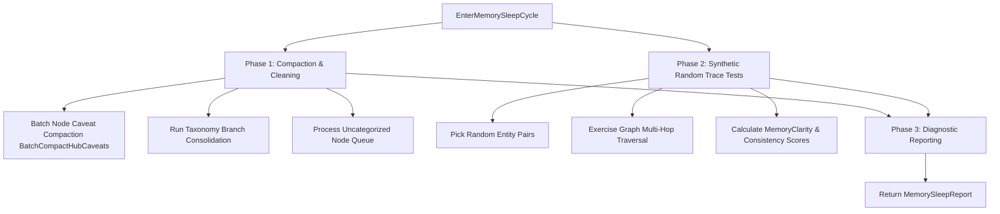

# Memory Maintenance Cycle & Synthetic Random Trace Tests Architecture Plan

## Overview

High-scale memory systems require a periodic offline **Memory Maintenance Cycle** to prevent memory degradation, compact historical revision caveats, consolidate taxonomy branches, and exercise graph clarity and consistency through **Synthetic Random Trace Tests**.

---

## Phases of the Memory Maintenance Cycle

### 1. Phase 1: Maintenance Compaction & Cleaning
* **Node Caveat Compaction:** Synthesizes historical edge caveats on hub entities while **preserving all expired temporal links (`valid_until <= now`) forever in SQLite for bi-temporal lineage and historical RAG**.
* **Taxonomy Consolidation:** Merges duplicate taxonomy categories in chunked 500-row transactions with yield pauses.
* **Orphan Classification:** Assigns uncategorized nodes to taxonomy paths (`ProcessUncategorizedBatch`).

### 2. Phase 2: Synthetic Random Trace Tests & Memory Exercise
* Picks pairs/triples of nodes from `semantic_nodes`.
* Generates synthetic question/answer scenario traces.
* Exercises graph retrieval (`FindMultiHopPath`).
* Calculates quantitative metrics using **`CalculateTraceClarity`** and **`CalculateTaxonomyPathOverlap`**:
  * $\text{MemoryClarityScore} \in [0.0, 1.0]$: Quantitative measure computed from multi-hop distance decay, caveat/conflict penalties, and materialized taxonomy path overlap coefficients:
    $$\text{Path Clarity} = \max\left(0.10, \frac{1.0}{1.0 + 0.1 \cdot (\text{hops} - 1)} - 0.10 \cdot N_{\text{caveats}} - 0.20 \cdot N_{\text{conflicts}}\right)$$
    $$\text{Taxonomy Clarity (Disjoint Graphs)} = 0.50 + 0.50 \cdot \text{TaxonomyOverlapRatio}$$
  * $\text{MemoryConsistencyScore} \in [0.0, 1.0]$: Ratio of consistent simulated answers (valid path or shared category domain) across trace pairs.

### 3. Phase 3: Diagnostic Reporting
Returns a structured `MemorySleepReport` containing compacted revision counts, consolidated branch counts, simulated trace test scenarios, and clarity/consistency metrics.

---

## Verification Strategy

* **Unit Tests (`pkg/engine/sleep_test.go`):**
  * `TestMemoryMaintenanceCycleAndRandomTraceTests`: Verifies historical link preservation, synthetic trace test scenario generation, and score calculations.
  * `TestCalculateTraceClarityMetrics`: Verifies path distance decay, caveat penalties, conflict penalties, and taxonomy path segment overlap coefficients.

