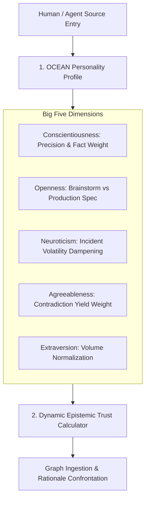

# OCEAN Source Personality Profile & Dynamic Trust Derivation Architecture Plan

## Overview

Assigning a harsh, flat scalar score (e.g. `TrustWeight = 300` out of 1000) to human sources is unpalatable to enterprise users and lacks cognitive nuance. The **OCEAN Source Personality Profile Engine** replaces static scalar human trust ratings with the **Big Five (OCEAN) Personality Model** (*Openness, Conscientiousness, Extraversion, Agreeableness, Neuroticism*).

This provides a psychologically grounded, human-palatable source profile while dynamically computing fine-grained epistemic trust weights ($W_{\text{trust}}$) and claim qualifiers for graph reasoning.

---

## Architectural Workflow



### 1. Data Model & Schema Extension

* **`source_profiles` SQLite Table:**
  ```sql
  CREATE TABLE IF NOT EXISTS source_profiles (
      source_id TEXT PRIMARY KEY,
      openness REAL DEFAULT 0.5,
      conscientiousness REAL DEFAULT 0.5,
      extraversion REAL DEFAULT 0.5,
      agreeableness REAL DEFAULT 0.5,
      neuroticism REAL DEFAULT 0.5,
      updated_at INTEGER NOT NULL
  );
  ```

* **Go Struct:**
  ```go
  type SourcePersonalityProfile struct {
      SourceID          string  `json:"source_id"`
      Openness          float64 `json:"openness"`          // 0.0 - 1.0 (Exploratory Hypothesis vs Strict Spec)
      Conscientiousness float64 `json:"conscientiousness"` // 0.0 - 1.0 (Factual Precision & Verification Weight)
      Extraversion      float64 `json:"extraversion"`      // 0.0 - 1.0 (Broadcast Volume Normalization)
      Agreeableness     float64 `json:"agreeableness"`     // 0.0 - 1.0 (Contradiction Yielding Weight)
      Neuroticism       float64 `json:"neuroticism"`       // 0.0 - 1.0 (Incident Alert Volatility Dampening)
  }
  ```

### 2. Dynamic Trust & Claim Qualifier Mechanics

1. **Dynamic Epistemic Trust Weight ($W_{\text{trust}}$):**
   $$W_{\text{trust}} = \text{Clamp}\left(500 + 400 \cdot C - 250 \cdot N + 150 \cdot (1 - O_{\text{speculative}}), 100, 1000\right)$$
2. **Exploratory Hypothesis Gating (Openness):**
   * Claims from High $O$ sources are tagged with `[EXPLORATORY_HYPOTHESIS]`. Requires verification before promotion to `NodeTypeRule`.
3. **Panic & Alert Dampening (Neuroticism):**
   * Emergency alerts from High $N$ sources require cross-verification before flagging graph-wide `REQUIRES_REVALIDATION`.

---

## Verification Strategy

* **Unit Tests (`pkg/engine/ocean_profile_test.go`):**
  * Test `DeriveTrustFromOCEANProfile`: Verifies dynamic $W_{\text{trust}}$ calculations and hypothesis gating across high-$C$ vs high-$N$ profiles.
