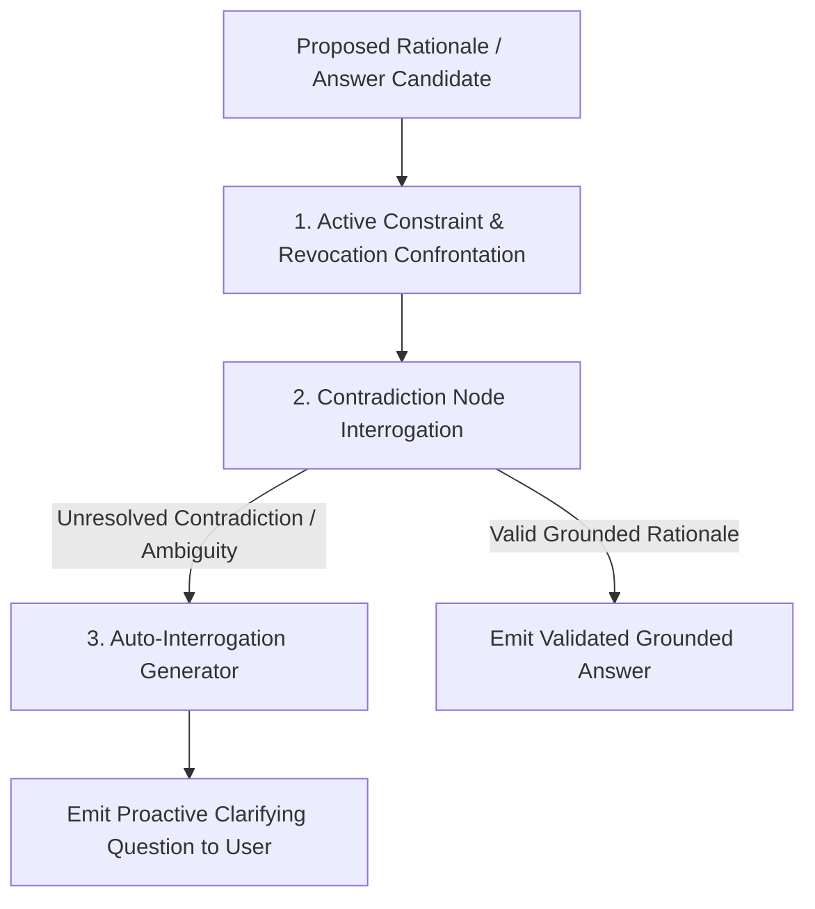

# Rationale Confrontation & Auto-Interrogation Architecture Plan

## Overview

When retrieved graph nodes contain conflicting assertions or unverified caveats, generating a response without prior validation leads to contradictory or ungrounded answers. **Rationale Confrontation & Auto-Interrogation** performs pre-generation validation, confronting proposed answer rationales against active epistemic constraints and generating clarifying questions when ambiguities exist.

---

## Architectural Workflow



### 1. Rationale Confrontation Engine
* Compares proposed claims against active rules (`NodeTypeRule`), active constraints (`NodeTypeConstraint`), and revoked states (`valid_until IS NOT NULL`).
* Detects when a rationale relies on a claim that was superseded or revoked by a higher-trust source.

### 2. Auto-Interrogation & Clarifying Inquiry
* When unresolved contradictions exist between two high-trust sources ($W_1 = 900, W_2 = 900$), the auto-interrogator constructs a targeted diagnostic query:
```go
type AutoInterrogationResult struct {
	IsRationaleValid      bool     `json:"is_rationale_valid"`
	ConflictingNodeIDs    []string `json:"conflicting_node_ids"`
	ClarifyingQuestion   string   `json:"clarifying_question"`   // Diagnostic question for user/system
	ConfrontationRationle string   `json:"confrontation_rationale"`
}
```

---

## Verification Strategy

* **Unit Tests (`pkg/engine/rationale_confrontation_test.go`):**
  * Test `ConfrontRationaleAndAutoInterrogate`: Verifies that conflicting assertions trigger automatic interrogation queries rather than emitting ungrounded answers.
