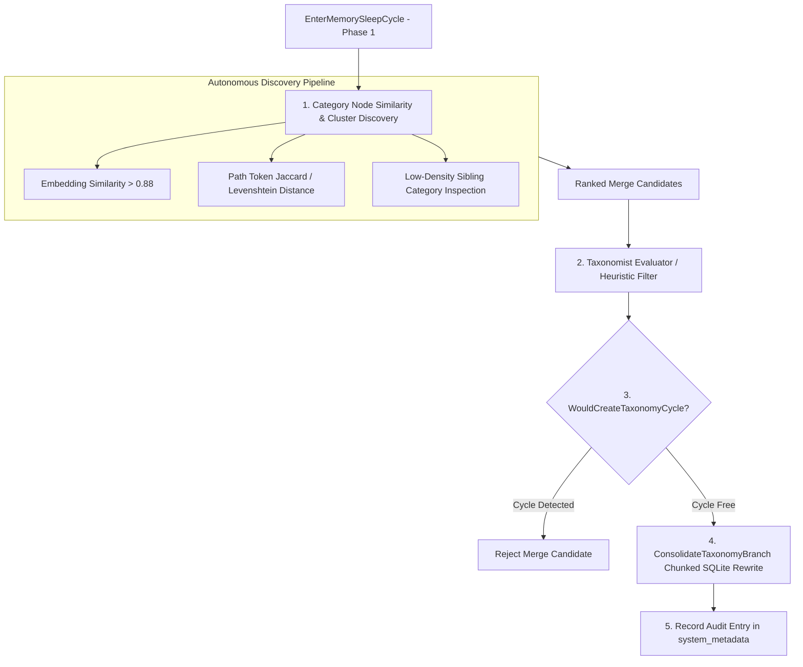

# Self-Healing Taxonomy Consolidation Architecture Plan

## Status: PROPOSED (Issue #14)

## Executive Summary & Critique of Current Implementation

The current codebase includes `ConsolidateTaxonomyBranch` in [`pkg/engine/taxonomy.go`](file:///home/laurent/gllam/pkg/engine/taxonomy.go#L292), which provides a robust, atomic, non-destructive SQLite branch rewriting engine. However, the periodic consolidation pass in [`pkg/engine/taxonomy_worker.go:80`](file:///home/laurent/gllam/pkg/engine/taxonomy_worker.go#L80) relies on a **hardcoded 3-entry static map**:

```go
consolidations := map[string]string{
    "/Engineering/DBs":                   "/Engineering/Infrastructure/Databases",
    "/Engineering/Database":              "/Engineering/Infrastructure/Databases",
    "/Engineering/Services/Microservices": "/Engineering/Services",
}
```

Labeling a 3-entry hardcoded map as "self-healing" is an over-claim. While the *tree-rewriting mechanism* works, true **self-healing** requires **autonomous runtime discovery** during offline memory maintenance (`EnterMemorySleepCycle`) of redundant, fragmented, or synonym taxonomy branches without manual configuration.

This document specifies the complete architecture for an autonomous, vector-assisted, cycle-safe **Self-Healing Taxonomy Engine** integrated into the `EnterMemorySleepCycle` sleep maintenance pipeline.

---

## Architectural Workflow (Sleep Cycle Integration)



---

## 1. Autonomous Branch Discovery Mechanisms

Instead of relying on hardcoded strings, the engine will discover merge candidates across three signals:

### A. Category Vector Centroid Similarity
For each category node (`is_category = 1`), compute its semantic embedding vector $V_{\text{cat}}$ (mean vector of all child entity nodes under that path):

$$\text{Sim}(C_1, C_2) = \frac{V_{C1} \cdot V_{C2}}{\|V_{C1}\| \|V_{C2}\|}$$

Category pairs with $\text{Sim}(C_1, C_2) \ge 0.88$ operating under the same parent sub-tree are flagged as potential duplicate branches (e.g., `/Engineering/Databases` vs `/Engineering/DB_Storage`).

### B. String & Path Token Jaccard Distance
For category path strings (e.g. `path1 = "/Engineering/Database"` and `path2 = "/Engineering/Databases"`):
- Tokenize path segments.
- Compute character Levenshtein distance and stemmed token overlap:
  $$\text{Jaccard}(S_1, S_2) = \frac{|S_1 \cap S_2|}{|S_1 \cup S_2|}$$
- Flag paths with high string token overlap ($\text{Jaccard} \ge 0.75$) and single-character plural/abbreviation differences (`DBs` $\leftrightarrow$ `Databases`).

### C. Low-Density Fragmented Sibling Inspection
During sleep cycles, query categories containing $< 2$ entity nodes whose sibling category contains $> 10$ nodes. Fragmented singletons are evaluated for merge into the primary sibling branch.

---

## 2. Proposed Data Model & Data Structures

```go
// PROPOSED — Self-Healing Taxonomy Merge Candidate (Issue #14)
type TaxonomyMergeCandidate struct {
	SourcePath      string  `json:"source_path"`       // e.g. "/Engineering/DBs"
	TargetPath      string  `json:"target_path"`       // e.g. "/Engineering/Infrastructure/Databases"
	SimilarityScore float64 `json:"similarity_score"` // Cosine similarity or Jaccard score
	Rationale       string  `json:"rationale"`        // e.g. "High vector similarity (0.92) and synonym overlap"
}

// PROPOSED — Audit Log Entry for Taxonomy Self-Healing (Issue #14)
type TaxonomyConsolidationAuditRecord struct {
	ID             string `json:"id"`
	SourcePath     string `json:"source_path"`
	TargetPath     string `json:"target_path"`
	NodesRewritten int    `json:"nodes_rewritten"`
	Timestamp      int64  `json:"timestamp"`
}
```

---

## 3. Dynamic Execution & Cycle Prevention

1. **Candidate Screening**: `DiscoverTaxonomyMergeCandidates(ctx)` inspects stored categories and outputs `[]TaxonomyMergeCandidate`.
2. **Cycle Check**: Before calling `ConsolidateTaxonomyBranch`, verify `WouldCreateTaxonomyCycle(ctx, sourceCatID, targetCatID)`.
3. **Non-Destructive Atomic Branch Rewrite**:
   - Execute path string substitution via SQLite `SUBSTR` and `REPLACE` in 500-row chunks.
   - Redirect `is_a`, `subclass_of`, `instance_of`, and `part_of` links.
   - Set `is_category = 0` on the old source category node to preserve its identity and history without deleting data.

---

## 4. Proposed Go API Signatures

```go
// DiscoverTaxonomyMergeCandidates scans category nodes and returns candidate branch merges based on
// embedding centroid similarity and path string token distance.
func (e *GllamEngine) DiscoverTaxonomyMergeCandidates(ctx context.Context) ([]TaxonomyMergeCandidate, error)

// RunAutonomousTaxonomySelfHealing executes discovery and applies valid, cycle-safe branch consolidations.
func (e *GllamEngine) RunAutonomousTaxonomySelfHealing(ctx context.Context) (int, error)
```

---

## Verification Plan

### Automated Unit Tests (`pkg/engine/self_healing_taxonomy_test.go`)
1. **`TestDiscoverTaxonomyMergeCandidates`**: Insert nodes under `/Engineering/DBs` and `/Engineering/Databases`. Assert candidate discovery flags them for consolidation based on token distance / similarity.
2. **`TestRunAutonomousTaxonomySelfHealing`**: Run self-healing pass without hardcoded maps. Assert paths are automatically rewritten to canonical targets while preserving historical node records.
