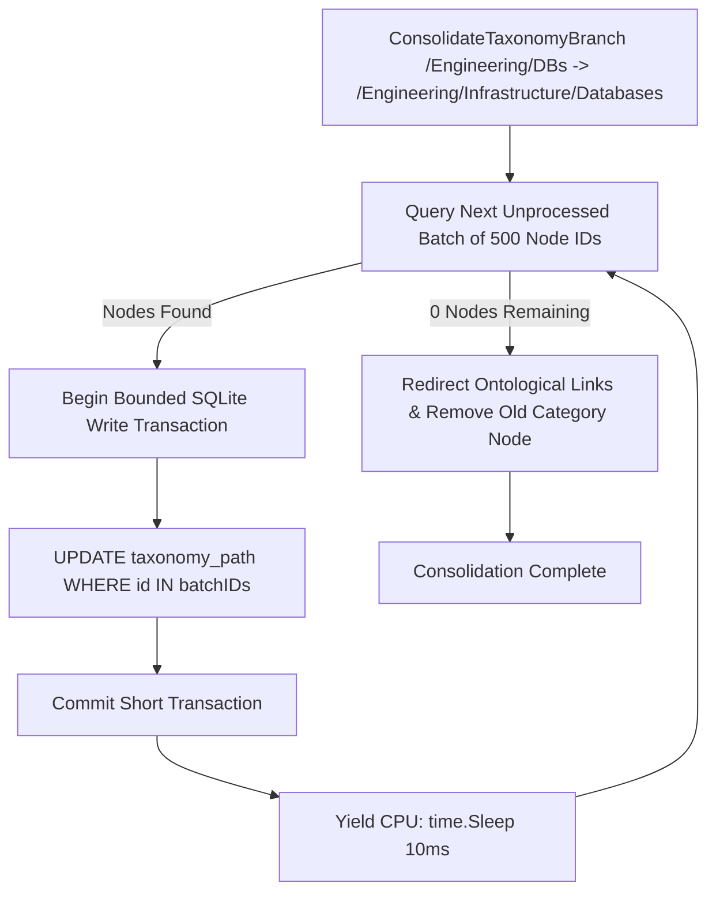

# Bounded Chunked Taxonomy Consolidation Architecture Plan

## Overview

When periodic taxonomy consolidation merges duplicate category branches (e.g. combining `/Engineering/DBs` and `/Engineering/Infrastructure/Databases`), rewriting `taxonomy_path` for thousands of child nodes in a single monolithic transaction holds an exclusive SQLite write lock on `semantic_nodes`. This blocks concurrent ingestion workers and causes `SQLITE_BUSY` errors.

This feature introduces **Bounded Chunked Transactions & Inter-Batch Yield Pauses** for taxonomy consolidation.

---

## Architectural Workflow

### 1. Bounded Transaction Chunks (`batchSize = 500`)
* Queries un-migrated node IDs matching the source category prefix in small batches of 500.
* Executes path updates within short, single-batch write transactions (`BeginTx` $\rightarrow$ `Commit`), minimizing lock duration.

### 2. Inter-Batch Yield Pauses (`10ms` sleep)
* Pauses for 10ms between transaction commits to allow concurrent read and write connection handles (`db` and `dbRO`) to execute without blocking high-frequency ingestion workers.

---

## Verification Strategy

* **Unit Tests (`pkg/engine/taxonomy_test.go`):**
  * `TestAutonomousOntologicalLayer`: Verified `ConsolidateTaxonomyBranch` rewrites materialized paths across child nodes cleanly using chunked transactions.
