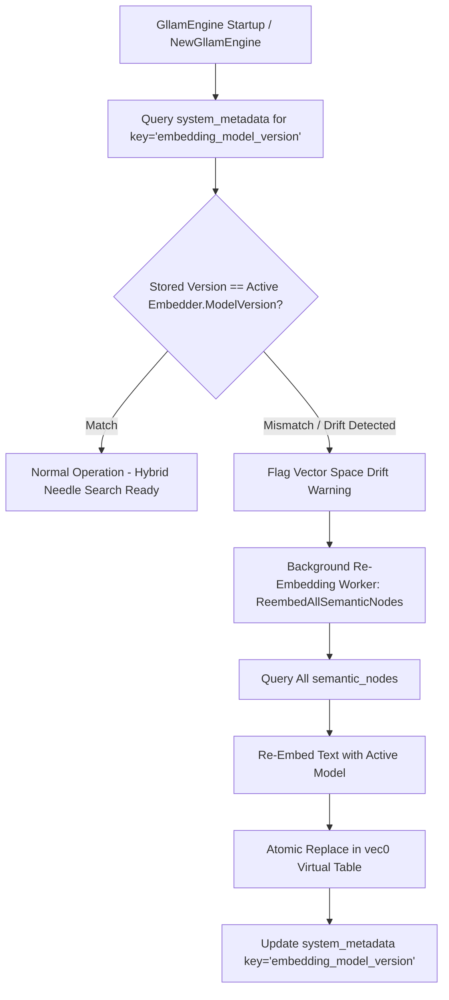

# Vector Space Drift Prevention & Re-Embedding Architecture Plan

## Overview

Swapping or upgrading the local embedding model (e.g. from `nomic-embed-text-v1.0` to `v2.0` or a different architecture) midway through or after ingesting a 25,000-document dataset renders stored vector embeddings in `sqlite-vec` mathematically incompatible with incoming query embeddings. Mixed embedding spaces severely degrade Reciprocal Rank Fusion (`RetrieveHybridNeedle`) and nearest-neighbor vector searches.

This feature prevents vector space drift by tracking embedding model version metadata in SQLite (`system_metadata`) and triggering automated background re-embedding tasks when model changes are detected.

---

## Architectural Workflow



### 1. Schema & Embedder Interface
* **`system_metadata` Table:**
  ```sql
  CREATE TABLE IF NOT EXISTS system_metadata (
      key TEXT PRIMARY KEY,
      value TEXT NOT NULL,
      updated_at INTEGER NOT NULL
  );
  ```
* **`Embedder` Interface Extension:**
  ```go
  type Embedder interface {
      Embed(ctx context.Context, text string) ([]float32, error)
      ModelVersion() string
  }
  ```

### 2. Core Drift Prevention APIs
* **`CheckEmbeddingModelVersion(ctx context.Context) (bool, string, string, error)`:**
  * Compares stored model version with `e.embedder.ModelVersion()`.
  * Returns `driftDetected`, `previousVersion`, `activeVersion`.
* **`ReembedAllSemanticNodes(ctx context.Context) (int, error)`:**
  * Queries `semantic_nodes` text prompts.
  * Re-computes vector embeddings using the new model.
  * Atomically replaces vectors in `semantic_embeddings` virtual table.
  * Updates `system_metadata` key `embedding_model_version` to the active model version.

---

## Verification Strategy

* **Unit Tests (`pkg/engine/reembed_test.go`):**
  * `TestVectorSpaceDriftPreventionAndReembedding`:
    * Initializes nodes with `v1.0` embedder.
    * Swaps embedder to `v2.0` and asserts `CheckEmbeddingModelVersion` detects drift.
    * Calls `ReembedAllSemanticNodes` and verifies vectors are re-indexed and metadata updated.
