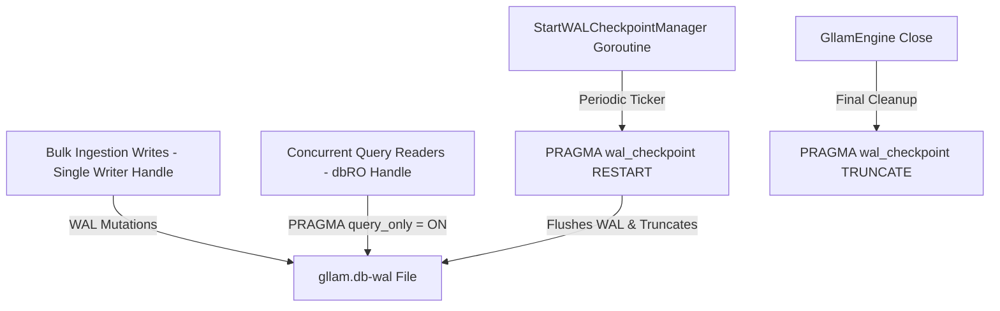

# WAL Checkpointing & Read-Only Handle Enforcement Architecture Plan

## Overview

High-frequency bulk ingestion (e.g., 15,000+ Jira issues and 10,000+ Confluence pages) generates millions of SQLite transactions. In Write-Ahead Logging (WAL) mode, this can cause the `gllam.db-wal` file to swell to tens of gigabytes. When SQLite attempts passive checkpoints (`wal_checkpoint(PASSIVE)`), concurrent read-only queries lock the WAL file, causing write stalls and `SQLITE_BUSY` errors.

This feature mitigates WAL file explosion and checkpoint stalls by implementing an **Explicit Background WAL Checkpoint Manager** and **Strict Read-Only Connection Enforcement**.

---

## Architectural Mitigation Blueprint

### 1. Connection-Level Pragmas & Safety Guards
* **Write Handle (`db`):** Single-writer mode (`MaxOpenConns = 1`), `PRAGMA journal_mode = WAL`, `PRAGMA wal_autocheckpoint = 1000`, `PRAGMA busy_timeout = 5000`.
* **Read-Only Handle (`dbRO`):** Dedicated connection pool (`MaxOpenConns = 8`), `PRAGMA query_only = ON;`, `PRAGMA busy_timeout = 5000;`. Mutations attempted on `dbRO` are immediately rejected at the SQLite engine level.

### 2. Explicit Checkpointing Engine APIs
* `CheckpointWAL(ctx context.Context, mode string) (int, int, error)`: Triggers explicit WAL checkpointing (`RESTART`, `TRUNCATE`, `PASSIVE`, or `FULL`).
* `StartWALCheckpointManager(ctx context.Context, interval time.Duration)`: Asynchronous background worker that executes `PRAGMA wal_checkpoint(RESTART)` during idle ingestion windows.
* `Close()`: Stops the background worker and executes a final `PRAGMA wal_checkpoint(TRUNCATE)` before closing connection handles.

---

## Verification Strategy

* **Unit Tests (`pkg/engine/wal_test.go`):**
  * `TestWALCheckpointingAndReadOnlyHandleEnforcement`:
    * Verifies `dbRO` rejects write mutations under `PRAGMA query_only = ON`.
    * Verifies explicit `RESTART` and `TRUNCATE` WAL checkpoints.
    * Verifies background `StartWALCheckpointManager` executes without lock contention.
